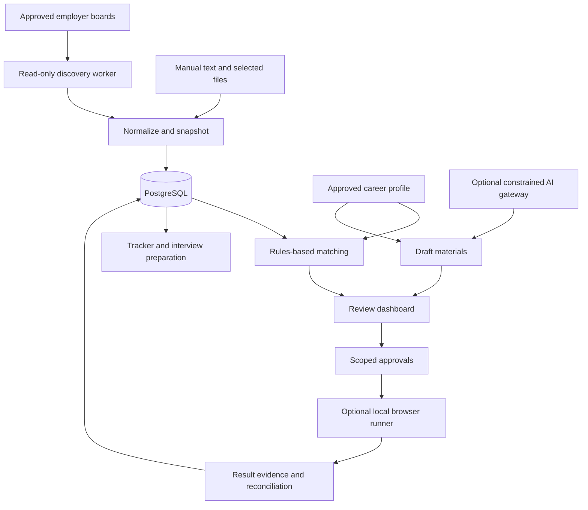

# Career Agent Stack

> A local-first career workspace that discovers relevant jobs, prepares evidence-backed applications, keeps an application ledger, and turns interview feedback into a learning plan.

**Document revision:** 0.2 · **Reviewed:** 2026-10-02  
**Status:** implementation specification, not a released application.  
**Name:** working title; confirm name and trademark availability before launch.  
**License:** not selected yet. Apache-2.0 is the recommended starting proposal, not a license grant.

**Read this first:** this deliverable is a README and build plan. It does not include a working repository, implemented adapters, tested installation scripts, or audited third-party software. All features, commands, API contracts, and acceptance targets below describe what contributors must implement. Do not advertise them as shipped until the corresponding tests and release gates pass.

## Navigation

| Start here | Implementation | Operations and release |
|---|---|---|
| [1. Product contract](#product-contract) | [7. Repository and toolchain](#repository) | [19. Security and privacy](#security) |
| [2. Scope and user journey](#scope) | [8. Data model and job identity](#data-model) | [20. Deployment and recovery](#operations) |
| [3. Existing products and reuse](#benchmarks) | [9. Career Profile and answer bank](#career-profile) | [21. Developer setup](#setup) |
| [4. Source policy](#source-policy) | [10. Eligibility and ranking](#matching) | [22. Tests and release gates](#quality) |
| [5. Board registry and discovery](#discovery) | [11. AI gateway and budgets](#ai) | [23. Roadmap and first tickets](#roadmap) |
| [6. Architecture](#architecture) | [12. Documents and profile improvement](#documents) | [24. Contribution and licensing](#contributing) |
|  | [13. Application states](#states) | [25. Decisions and known limitations](#decisions) |
|  | [14. Consent and automation levels](#automation) | [26. Sources](#sources) |
|  | [15. Submission and recovery protocol](#submission) |  |
|  | [16. Tracker and email](#tracking) |  |
|  | [17. Interview coach](#interviews) |  |
|  | [18. Analytics](#analytics) |  |

---

<a id="product-contract"></a>
## 1. Product contract

The objective is **less repetitive work and better-controlled applications**, not the largest possible application count.

The product must be useful before adding an LLM or a browser bot:

```text
Approved career facts + selected employer boards
                    ↓
Discover → normalize → deduplicate → assess eligibility
                    ↓
Explain fit → shortlist → prepare documents and answers
                    ↓
Review → optionally autofill → submit with explicit authorization
                    ↓
Record evidence → track outcomes → prepare interviews → improve profile
```

### Non-negotiable rules

| Rule | Required behavior |
|---|---|
| Candidate facts outrank generated text | Use user-approved evidence; unknown stays unknown. |
| Deterministic policy outranks model output | An LLM cannot grant consent, spend beyond budget, or authorize submission. |
| Technical capability is not permission | A public endpoint or working selector does not establish authorization for every use. |
| Side effects require prior consent | Apply this before entering personal data, uploading files, accepting terms, or submitting. |
| Ambiguous submission is not a retryable failure | Reconcile it; do not automatically click Submit again. |
| Local-first does not mean fully offline | ATS discovery needs the network; optional cloud AI and email have separate disclosures. |
| Documentation must match implementation | Label proposed, experimental, supported, and disabled capabilities accurately. |

A personal career record is **user-attested**, not independently verified by this software. The UI must not imply that approving a fact proves a degree, employment claim, or legal entitlement.

### Success criteria

Measure time spent preparing an application, correction rate, evidence traceability, duplicate-prevention failures, and observed interview conversion. Treat interview conversion as an outcome to monitor, not a promised result.

The default installation must work without paid AI, Gmail authorization, LinkedIn credentials, or a subscription to another job-search product.

---

<a id="scope"></a>
## 2. Scope and user journey

### Release slices

| Slice | Promise | Explicitly excluded |
|---|---|---|
| **v0.1: private career workspace** | Approved profile, board-based discovery, explainable rules-based ranking, tracker, reviewed resume variants, export/backup | Browser autofill, unattended submission, automatic mailbox access, hosted multi-tenancy |
| **v0.2: assisted applications** | One tested ATS autofill adapter, local visible browser, consent and review, confirmation reconciliation | Universal ATS coverage, unattended submission |
| **Later experimental release** | Narrowly authorized auto-submit, email intelligence, interview coaching | Any guarantee of interviews, universal automation, or exactly-once delivery to third-party websites |

AI-assisted wording is optional in v0.1. Selecting approved facts and rendering a template must still work with `AI_PROVIDER=none`.

### First-use journey

1. Start a private workspace and review the privacy/settings screen.
2. Enter career facts or import a CV as **unapproved suggestions**; approve the facts individually or through an explicit reviewed batch.
3. Configure target roles, eligible work locations, languages, preferences, and unanswered questions. Never preload someone else's authorization or salary answers.
4. Add a verified employer board or import a small board list. Preview discovery before enabling its schedule.
5. Review jobs with clear eligibility evidence, fit components, missing information, source coverage, and freshness.
6. Prepare and approve a document/answer version. In v0.1, apply manually on the official site and record the result.
7. Export the workspace and test a restore before relying on it for an active search.

For v0.2, the user may explicitly authorize the local runner to fill a particular application, review it in that same browser, and submit it themselves.

### Non-goals

No LinkedIn scraping, Easy Apply bot, recruiter-message blasting, CAPTCHA solving, MFA bypass, proxy rotation to evade restrictions, employer credential harvesting, or paywall circumvention. No hidden live-interview copilot or automatic completion of an employer's assessment. No sale of candidate data or cross-user training by default.

Do not build a general-purpose agent marketplace, Kubernetes deployment, vector database, remote desktop service, or billing platform for the MVP.

---

<a id="benchmarks"></a>
## 3. Existing products and what to reuse

These are **documentation comparisons**, not hands-on reliability, security, or conversion benchmarks. Vendor descriptions and repository READMEs do not prove that an advertised workflow works end to end. Prices are dated reference points, not quotations or guaranteed future costs.

### Commercial workflow references

| Product | Documented pattern | Design to reproduce independently | Budget note |
|---|---|---|---|
| Simplify | Profile/answer reuse, autofill, user review and submission, subsequent tracking | An answer bank and application-linked tracking; preserve user control | Evaluate its free functionality before building convenience features. [R06] |
| Huntr | Base resumes, tailored variants, matching and job tracking | Immutable resume versions linked to applications | Official help lists Basic at $0 and Pro at $40/month; Basic tracks up to 100 jobs. [R07] |
| Teal | Resume workspace and job tracker | A comprehensive profile with role-specific outputs | Its pricing page lists free core tools and a $13/week premium option at review time. [R08] |
| Careerflow | Browser-based saving, autofill and keyword matching | A connected review workflow and reusable fields | Use the workflow as a reference; no premium dependency is required. [R09] |
| Rezi | Resume templates, keyword targeting and analysis | Text-extraction checks, consistency linting and evidence coverage | Pricing page lists Free and $29/month Pro at review time. [R10] |

Do not reproduce proprietary templates, branding, source code, prompts, or paid access mechanisms. Build comparable functionality from documented requirements. Do not market internal keyword coverage as an actual employer ATS score.

### Public-source projects

| Project | What its documentation establishes | Decision |
|---|---|---|
| `shunsukefuruyama/ats-jobs` | MIT library advertising normalized reads for 12 ATS platforms; explicit-board and company-domain inputs | Evaluate in a bounded spike. Domain mode probes providers and can read career-page HTML, so the earlier “no HTML” shorthand is not universally accurate. Prefer verified explicit boards. [R11] |
| `dabloo26/job-application-agent` | Describes Playwright safety gates and human escalation | Use as a behavioral reference. A reusable license was not established in this review; do not import its code without resolving that. Its published results are not our validation. [R12] |
| `Liam-Frost/AutoApply` | Local-first architecture and audit concepts; README also identifies form-fill/click-submit and some synchronization paths as unimplemented | Architecture reference, not evidence of a complete working substitute. PolyForm Noncommercial is source-available with use restrictions, not an unrestricted open-source dependency. [R13] [R30] |

A library's coverage claim is **not** our support matrix. Do not inherit its automatic probing, outbound networking, concurrency, or error semantics without reviewing them.

### Build / reuse decision

**Build:** the career evidence model, approvals, application ledger, reconciliation, matching policy, and review experience.

**Reuse after review:** browser automation, SQL/queue libraries, schema validation, document rendering, and narrow discovery adapters.

**Defer:** universal browser agents, multiple hosted AI providers, managed vector infrastructure, and broad platform coverage.

Before adopting any package, record an exact version/commit, license and notices, transitive dependencies, network behavior, tests, failure modes, and replacement strategy. Test against fixtures before enabling live reads. Never install a public repo simply because this README mentions it.

---

<a id="source-policy"></a>
## 4. Source policy and support boundaries

### Discovery is not submission

| Provider | Documented discovery boundary | Submission boundary | Planned priority |
|---|---|---|---|
| Greenhouse | Public Job Board GET endpoints scoped to a board token | Documented application POST requires an employer-side Job Board API key | First read adapter. [R02] |
| Lever | Postings scoped to a site; global and EU hosts exist | Documented application POST requires a key generated by an account Super Admin | Second read adapter; keep region in identity. [R03] |
| Ashby | Public endpoint scoped to a jobs-page name | A public posting response is not a grant to use employer-side APIs | Third read adapter; include only listed jobs in bulk discovery. [R04] |
| SmartRecruiters | Posting API exposes a company's postings | Candidate submission needs a separately evaluated integration/official flow | After the first three adapters. [R05] |
| Other ATS/career sites | May have documented feeds or undocumented website endpoints | No assumed authorization or stable contract | Experimental only; separate evidence and fixtures required |
| LinkedIn | User-supplied text/URLs or user-selected alert messages | No browser automation in this project | Store provenance; do not fetch LinkedIn pages automatically. [R01] |

LinkedIn's policy prohibits the relevant third-party scraping/automation behavior. Manual URL import must not secretly trigger a browser, HTTP fetch, preview crawler, or authenticated redirect resolution on LinkedIn. Ask the user for the description or the employer's official URL instead. [R01]

Creating a LinkedIn developer application is not an MVP prerequisite. The project does not depend on a public candidate job-search/submission API.

### Permission registry

Maintain **separate** records for source access, form interaction, PII transfer, and final submission. A candidate's approval cannot override a platform restriction.

Each integration must record:

```text
provider + tenant/board + region
exact API host / allowed career origin
capabilities requested
DOCUMENTED_PUBLIC_READ | SITE_ENDPOINT_EXPERIMENTAL | MANUAL_ONLY
authentication requirements
terms/reference URLs and review notes
permission_status: APPROVED_FOR_SCOPE | UNKNOWN | BLOCKED
reviewed_at + review_due_at
rate-limit behavior and contact/owner
adapter version + fixture coverage
```

`UNKNOWN`, `BLOCKED`, or an expired review disables the relevant automated capability. Supporting an ATS brand does not authorize every tenant, custom domain, form, or action on it.

Respect published limits, applicable terms, and relevant crawl directives. `robots.txt` is neither a blanket permission grant nor a substitute for checking terms. Do not redistribute full job-description datasets without checking their rights and retention requirements.

---

<a id="discovery"></a>
## 5. Employer board registry and discovery

### The missing dependency: which companies?

These ATS endpoints are **board-scoped, not a global job-search engine**. Greenhouse needs a board token, Lever a site, and Ashby a jobs-page name. Selecting “SDET + Spain” without any boards cannot search the whole market. [R02] [R03] [R04]

The MVP therefore starts with a **user-approved board registry**:

```text
Company career URL or licensed board list
                 ↓
Resolve candidate board → verify company association → user approval
                 ↓
Save provider + tenant + region + allowed origins
                 ↓
Fetch board → normalize → apply local search preferences
```

Board discovery and job discovery are different tasks. Prefer a board linked from the employer's official career site. A slug matching the company name, a first successful HTTP response, or an LLM guess is not sufficient proof of identity.

The UI must show “Searching 12 configured boards; last successful refresh …”, not “Searching all jobs”. Empty configuration returns `NO_BOARDS_CONFIGURED`, not a misleading zero-results report.

### Configuration example

All examples contain synthetic data. The board below is intentionally disabled and is not a functioning integration.

```yaml
schema_version: 1
boards:
  - id: example-employer-eu
    provider: greenhouse
    tenant: replace-with-verified-board-token
    region: global
    company_name: Example Employer
    company_domain: careers.example.com
    careers_url: https://careers.example.com/jobs
    association_status: UNVERIFIED
    permission_status: UNKNOWN
    allowed_application_origins: []
    enabled: false

search_profiles:
  - id: software-testing-europe
    enabled: false
    board_ids: [example-employer-eu]
    titles:
      - Software Development Engineer in Test
      - SDET
      - QA Automation Engineer
    country_preferences: [ES, NL, DE]
    work_modes: [remote, hybrid]
    unknown_location_policy: NEEDS_REVIEW
    maximum_posted_age_days: 14
    unknown_posted_date_policy: INCLUDE_WITH_WARNING
```

“Remote” is a work mode, not proof of permission to work from any country. Keep contractual employment type separate from schedule: `full_time` does not establish `permanent`.

### Reader contract

Illustrative TypeScript contract; implement runtime schemas as well as types.

```ts
export type ProviderId = 'greenhouse' | 'lever' | 'ashby' | 'smartrecruiters';

export interface BoardRef {
  id: string;
  provider: ProviderId;
  tenant: string;
  region: string;
}

export interface DiscoveryItem {
  externalId: string;
  title: string;
  jobUrl: string;
  applyUrl: string | null;
  descriptionText: string | null;
  raw: unknown; // Parse through a provider-specific runtime schema.
}

export interface DiscoveryBatch {
  items: DiscoveryItem[];
  nextCursor: string | null;
  coverage: 'PARTIAL' | 'COMPLETE';
  fetchedAt: string;
}

export interface JobSource {
  readonly provider: ProviderId;
  fetchBoard(
    board: BoardRef,
    options: { cursor?: string; signal: AbortSignal }
  ): Promise<DiscoveryBatch>;
}
```

Keep network-policy enforcement outside the LLM and unavoidable for every adapter. Prefer an injected bounded HTTP client; reject libraries that bypass the required outbound controls until isolated or changed.

### Refresh and lifecycle rules

Proposed conservative defaults, **not vendor rate limits**: one active read request per board, a six-hour refresh interval with jitter, bounded pages/response bytes, and exponential backoff for retryable reads. Respect `Retry-After`; repeated access denials disable the source rather than trigger evasion.

Store `source_posted_at`, `source_updated_at`, `first_seen_at`, `last_seen_at`, and `last_successful_refresh_at` separately. Missing published dates remain null. Never label an old job “newly posted” because the system first saw it today.

A completed refresh updates presence only after **all pages succeeded**. Partial results, schema errors, timeouts, and HTTP failures cannot mark missing jobs closed. After repeated complete refreshes show absence, mark `POSSIBLY_CLOSED`; use a provider-specific confirmed closure signal or user confirmation for `CLOSED`.

Cache public reads where allowed. Extract expensive details only for plausible jobs. A sleeping laptop misses scheduled runs; run one catch-up refresh when it resumes rather than replaying every missed interval.

---

<a id="architecture"></a>
## 6. Architecture

### Modular monolith, explicit privilege boundaries



One repository and one database, with a UI, API, background worker, and an **optional local browser runner**. Separate processes are not independent microservices: they share versioned domain contracts and release together.

| Layer | Decision | Boundary |
|---|---|---|
| Web | Next.js | Dashboard only; no duplicated business rules or direct browser-side database access |
| API | Fastify + Zod + OpenAPI | Owns authentication, workspace authorization, consent, commands, and validations |
| Database | PostgreSQL + Drizzle migrations | System of record; explicit transactions and constraints |
| Queue | pg-boss | Read/analysis/preparation jobs; no generic automatic retry of irreversible submissions |
| Browser | Playwright, in the local runner | Only approved application plans; no access to LLM API keys or the whole profile database |
| Documents | Local HTML/CSS renderer using Playwright | Separate clean rendering context; no arbitrary remote assets or scripts |
| AI | Small provider interface | No tools, shell access, secret access, or submission permissions |
| Tests | Vitest + Playwright + PostgreSQL integration tests | Fixtures and mock ATS are the default |
| Storage | Local filesystem | Workspace-scoped artifacts, private permissions, optional encryption |

Next.js proxies `/api` to Fastify so the UI has one browser origin. Do not create a second authorization system in server actions. Use pg-boss with the documented version's connection and transaction requirements; it supports durable work and scheduling, but this does not make a third-party form submission exactly once. [R14]

No Redis, Celery, Spring service, LangChain, embeddings, or pgvector is necessary for the first release. Add infrastructure only after a measured bottleneck or a validated product need.

### Why the browser runner is local

A headless browser on a VPS cannot automatically hand its live session to the user's ordinary desktop browser. The first supported autofill flow launches **a visible Playwright browser on the user's computer**, preserves that exact context, and lets the user review it there.

A Docker-only or hosted deployment initially supports discovery, materials, and tracking. It does **not** claim a working Level-3 handoff. A paired remote/local runner is a future feature requiring its own authentication and isolation tests. Never expose Chrome debugging, a remote browser port, or VNC publicly as a shortcut.

For local runner access, issue a short-lived, workspace- and application-scoped token. The runner polls for approved work and returns structured evidence; it does not receive unrestricted database credentials.

---

<a id="repository"></a>
## 7. Repository and toolchain

### Planned layout

```text
career-agent-stack/
├── apps/
│   ├── web/                     # Next.js dashboard
│   ├── api/                     # Fastify, auth, command handlers
│   ├── worker/                  # discovery, matching, documents
│   ├── runner/                  # optional local visible browser
│   └── mock-ats/                # synthetic site, never a real employer
├── packages/
│   ├── domain/                  # canonical enums and transitions
│   ├── contracts/               # Zod schemas, API/worker contracts
│   ├── db/                      # schema, constraints, migrations
│   ├── config/                  # validated config and capability flags
│   ├── sources/                 # board readers + network policy
│   ├── matching/                # eligibility, fit, priority
│   ├── profile/                 # facts, revisions, approved answers
│   ├── documents/               # templates, extraction, lineage
│   ├── applications/            # approvals, plans, reconciliation
│   ├── adapters/                # browser form adapters
│   ├── ai/                      # providers, schemas, budgets, cache
│   ├── email/                   # selected imports; OAuth later
│   └── observability/           # structured events and redaction
├── config/                      # synthetic examples, no personal profile
├── fixtures/                    # synthetic/sanitized, provenance recorded
├── docs/
│   ├── adr/
│   ├── adapters/
│   ├── security/
│   └── operations/
├── scripts/
├── templates/resumes/
├── .env.example
├── .gitignore
├── .dockerignore
├── .node-version
├── pnpm-workspace.yaml
├── pnpm-lock.yaml
├── compose.yaml
├── CONTRIBUTING.md
├── SECURITY.md
├── THIRD_PARTY_NOTICES.md
└── README.md
```

This tree is a build target, not a list of files delivered with this document. Start with the packages actually needed; do not create empty abstraction layers solely to match the diagram.

### Version policy

Use Node.js **24 LTS as the initial candidate baseline**; the official release table lists it as LTS at this review. M0 must pin a current supported patch and run the compatibility matrix before publishing an install guide. [R15]

Pin the package-manager version in `packageManager`, the Node patch in the version file, exact dependency resolution in `pnpm-lock.yaml`, and container images by tested version/digest. Do not use floating `latest` images for reproducibility.

The Playwright package and installed browser binaries must match. Its browser documentation explicitly ties binaries to package versions. [R16]

Required initial validation targets: Linux x64 CI and a documented macOS arm64 local smoke test. Mark Windows/WSL or other platforms unverified until actually tested. Do not claim compatibility from TypeScript compilation alone.

---

<a id="data-model"></a>
## 8. Data model and job identity

### Core entities

| Area | Tables/entities |
|---|---|
| Ownership | `workspaces`, `users`, `workspace_memberships` |
| Career evidence | `career_profiles`, `profile_versions`, `profile_facts`, `answer_versions` |
| Discovery | `boards`, `source_policy_reviews`, `search_profiles`, `discovery_runs` |
| Job records | `jobs`, `job_occurrences`, `job_snapshots`, `job_matches`, `job_merge_events` |
| Materials | `document_versions`, `document_claims`, `document_approvals` |
| Applications | `applications`, `application_plans`, `approval_grants`, `submission_attempts`, `submission_permits` |
| Audit/work | `application_events`, `outbox_events`, `automation_runs`, `automation_steps` |
| Optional intelligence | `email_events`, `interviews`, `interview_sessions`, `learning_items` |
| AI/operations | `llm_usage`, `budget_reservations`, `adapter_health`, `deletion_jobs` |

Use JSONB for evolving source payloads and typed constraints for identities, states, ownership, and references. Avoid normalizing every profile field into a separate table before a use case needs it.

Every user-owned row has `workspace_id`. Child references must match it using composite foreign keys or equivalent enforced constraints. `workspace_id` is not, by itself, authorization or SaaS readiness.

### Canonical job identity

Primary source identity:

```text
provider + region + tenant/board + external_job_id
```

Associate one canonical job with multiple source occurrences only when strong evidence establishes the relationship. Prefer a shared provider ID, a known employer requisition ID, or a safely normalized canonical application URL.

Title/company/location similarity and description hashes are **deduplication hints**, not unique keys. They can describe distinct openings. Preserve location sets, separate requisitions, multiple boards, and explicitly permitted reapplication cycles.

Never strip identity-bearing URL parameters such as a requisition ID as “tracking”. Use provider-specific URL normalization. Keep source URLs separately from the canonical application URL. Ambiguous cross-source duplicates require review; merges must be reversible and preserve the audit trail.

### Integrity requirements

```text
UNIQUE (workspace_id, provider, region, tenant, external_job_id)
    on source occurrences

UNIQUE (workspace_id, canonical_job_id, application_cycle)
    on applications

UNIQUE (workspace_id, application_id, attempt_number)
    on submission attempts

UNIQUE (workspace_id, application_id, attempt_number)
    on submission_permits (one-use permits)
```

Enforce at most one unresolved submission attempt per application with a partial unique index covering `PREPARED`, `IN_PROGRESS`, and `UNKNOWN` attempt states. A new attempt requires the recovery rules in section 15, not merely a different UUID.

Store immutable profile/job/document revisions. Updating the base profile must not change the historical record of what was sent.

---

<a id="career-profile"></a>
## 9. Career Profile and answer bank

A CV is an output. The source of truth is structured, user-approved evidence with version history.

### Minimal synthetic profile

```yaml
schema_version: 1
profile_id: example-profile
locale: en-GB
timezone: Europe/Madrid
identity:
  full_name: Example Candidate
  email: candidate@example.com
  country: ES
  phone: null
preferences:
  target_titles: [SDET, QA Automation Engineer]
  work_modes: [remote, hybrid]
  employment_types: [permanent]
  minimum_salary:
    amount: null
    currency: EUR
    period: year
    basis: gross_base
facts:
  - id: fact-java-001
    kind: skill_evidence
    statement: Built API tests using Java 17 and REST Assured.
    tags: [java, rest-assured, api-testing]
    approval_status: USER_APPROVED
    approved_at: '2026-10-02T12:00:00Z'
    evidence_type: USER_ATTESTATION
  - id: fact-ci-001
    kind: achievement
    statement: Integrated the API test suite into Jenkins pipelines.
    tags: [jenkins, ci-cd]
    approval_status: USER_APPROVED
    approved_at: '2026-10-02T12:00:00Z'
    evidence_type: USER_ATTESTATION
experience:
  - id: experience-001
    company: Example Employer
    title: QA Automation Engineer
    start_month: '2023-06'
    end_month: null
    fact_ids: [fact-java-001, fact-ci-001]
answers:
  - id: work-authorization-es
    semantic_key: legally_authorized_to_work
    jurisdiction: ES
    question_scope: current_employment
    value: null
    approval_status: UNANSWERED
    review_after: null
    strategy: ASK_USER
  - id: sponsorship-es
    semantic_key: sponsorship_required
    jurisdiction: ES
    question_scope: now_or_in_future
    value: null
    approval_status: UNANSWERED
    review_after: null
    strategy: ASK_USER
```

Sample approval flags refer only to this fictional candidate. Demo mode must never submit or upload demo data to a real employer. Empty production onboarding must contain **no preapproved personal answers**.

### Answer semantics

Work authorization is jurisdiction- and question-specific. “Authorized now” and “requires sponsorship now or in the future” are different questions. Never infer the answer from residence, name, language, nationality, or an answer for another country.

Store an approved answer with its exact question meaning, jurisdiction, applicable employment arrangement, effective/review dates, and source. A negated or broader question must not reuse a boolean by approximate semantic similarity.

| Strategy | Behavior |
|---|---|
| `EXACT_APPROVED` | Reuse an in-scope, current approved answer. |
| `DERIVED_RULE` | Use a documented deterministic calculation; retain inputs and rule version. |
| `DRAFT_FOR_REVIEW` | Generate proposed wording from approved facts; never silently approve it. |
| `ASK_USER` | Pause until answered or the application is skipped. |
| `LEAVE_OPTIONAL_BLANK` | Leave blank when allowed; do not silently select a demographic response. |

Salary answers retain currency, period, gross/net basis, and base/total-compensation meaning. Do not annualize without known assumptions or convert currencies without a dated rate. Keep past compensation and future expectations separate.

Compute experience from validated date intervals without double-counting overlapping roles. Distinguish professional, academic, and personal-project experience. Do not convert “used a tool once” into years of experience.

Sensitive demographic disclosures default to manual-only and are excluded from matching and LLM inputs. Store them only on explicit request, separately protected. Notices, declarations, consent checkboxes, and signatures are not ordinary autofill fields.

---

<a id="matching"></a>
## 10. Eligibility and ranking

### Three-valued eligibility

```text
PASS          All evaluated hard constraints are satisfied.
FAIL          An explicit hard constraint is demonstrably violated.
NEEDS_REVIEW  Required evidence is absent, ambiguous, stale, or conflicting.
```

Unknown work location, missing salary, ambiguous sponsorship wording, or a skill absent from the profile is not automatically proof of incompatibility. Explain which missing fact needs review. Jobs can remain visible and receive a provisional fit analysis while automation is blocked.

Every decision stores the source requirement/span, approved profile fact or answer, rule version, and reason code. If a hard requirement was extracted by an LLM and has not been reliably validated, uncertainty must propagate into `NEEDS_REVIEW` rather than an irreversible rejection.

Suggested reason codes:

```text
LOCATION_UNCLEAR             AUTHORIZATION_UNANSWERED
AUTHORIZATION_INCOMPATIBLE   SALARY_NOT_COMPARABLE
SALARY_BELOW_MINIMUM         REQUIRED_LANGUAGE_UNCONFIRMED
CREDENTIAL_REQUIRED         USER_BLOCKLIST_MATCH
POSTED_DATE_UNKNOWN         JOB_DESCRIPTION_INCOMPLETE
```

### Two separate scores

`fit_score` describes evidence coverage for the role. `priority_score` reflects the user's preferences. Neither is a probability of employment, an employer ATS score, or a calibrated hiring prediction.

Suggested initial fit weights, **design defaults to validate**, not research-derived hiring weights:

| Component | Weight |
|---|---:|
| Required skill/evidence coverage | 40 |
| Relevant experience and seniority evidence | 25 |
| Role/function alignment | 15 |
| Preferred skill coverage | 10 |
| Domain/context evidence | 10 |

Each component is normalized to 0–1. Compute the weighted score over evaluable components and display `evidence_coverage` alongside it. Do not award a perfect component score because the listing omitted its requirements. Hide or label the overall score provisional when too little is evaluable.

Priority may combine fit, location, compensation, company preference, recency, and career direction, with independently visible weights. Hard eligibility always gates automation regardless of score.

Use rules and normalized skill aliases first. Optional LLM extraction can classify requirements and explain gaps. Model-generated `confidence` is not a measured probability; display it as model self-assessment or omit it until calibrated against a labeled set.

Avoid rules such as “never apply below 78” learned from a handful of outcomes. Let the user override ranking, but not safety or authorization policy.

---
<a id="ai"></a>
## 11. AI gateway, privacy and budgets

### Optional, bounded language processing

`none` is a supported provider mode, not an error. Manual editing, discovery, ranking rules, templates, tracking, and export must not depend on AI.

Implement a fake provider for tests, then local Ollama, then **one** reviewed hosted BYOK provider. Additional providers are adapters, not MVP requirements.

```ts
export interface StructuredRequest<T> {
  operation: 'extract_requirements' | 'draft_claims' | 'prepare_interview';
  data: unknown; // Minimized, schema-validated input; never raw workspace state.
  parse: (value: unknown) => T;
  maxOutputTokens: number;
  timeoutMs: number;
  signal: AbortSignal;
}

export type GenerationResult<T> =
  | { status: 'OK'; value: T; inputTokens: number; outputTokens: number }
  | {
      status: 'BLOCKED' | 'FAILED';
      reason: 'BUDGET' | 'PRIVACY' | 'SCHEMA' | 'TIMEOUT' | 'PROVIDER';
    };

export interface LlmProvider {
  readonly id: string;
  generate<T>(request: StructuredRequest<T>): Promise<GenerationResult<T>>;
}
```

The gateway performs runtime validation, context-size checks, output parsing, bounded retries, budget reservation, and provider policy checks. Provider JSON modes do not replace application validation. Refusals and invalid outputs are valid failure paths, not excuses to switch to a less constrained model.

No model receives browser tools, unrestricted HTTP requests, shell commands, database access, secrets, or a capability to change its own policy. Treat imported documents, job descriptions, email bodies, and model output as untrusted data. Delimiters and “ignore malicious instructions” prompts are not a complete defense. [R21]

### Cache and cost accounting

Cache keys must include:

```text
workspace_id + operation + minimized_input_hash
profile_revision + job_snapshot_hash
prompt_version + output_schema_version
provider + exact_model_identifier + generation_settings
```

Use bounded cache retention and purge workspace caches on deletion. Do not share personal-profile caches across users. Record provenance for cached results and never regenerate on a dashboard GET request.

For hosted calls, reserve estimated maximum cost **atomically before dispatch**, using a versioned price table, token ceiling, and safety margin. Count concurrent reservations against both daily and monthly budgets. Settle after reported usage; uncertain timeouts retain a conservative reservation until reconciled. Unknown pricing blocks paid execution.

Budget exhaustion produces `status=BLOCKED, reason=BUDGET`; work waits or switches to an explicitly approved local/manual path. No silent paid fallback. Provider-side billing controls remain a second boundary: application-side estimates cannot guarantee an exact external invoice.

### Local inference

Local inference avoids a per-token API bill but consumes memory, electricity, disk space, and maintenance time. Do not promise that an arbitrary model will run well on an 8 GB machine alongside a browser and development servers.

Ollama supports cloud features as well as local models. For the strict local profile, use downloaded local models and disable cloud features in the **Ollama server process**, for example with `OLLAMA_NO_CLOUD=1` as documented. Setting a variable only in this application's environment is not enough if Ollama runs separately. [R19]

### Hosted provider consent

Before enabling a provider, show what data leaves the device, purpose, destination, retention/training terms, regions, and cost settings. Send only the facts needed for the operation; remove contact details and sensitive answers unless strictly necessary and separately approved. Redaction reduces exposure but is not a guarantee of anonymity.

**Gemini-specific correction:** its current terms include regional differences. For users in the EEA, Switzerland, and the UK, the Paid Services data-use section also applies to unpaid quota. The terms separately require Paid Services when making API clients available to users in those regions. Therefore “free Gemini always trains on your data” and “a public European app can always rely on the unpaid tier” are both inappropriate blanket claims. Recheck the exact deployment and terms before enabling it. [R20]

The portable $0-service-fee baseline is `none` or local inference—not an assumed perpetual cloud free tier.

---

<a id="documents"></a>
## 12. Documents and profile improvement

### Evidence-backed does not mean hallucination-proof

A model can attach a valid fact ID to an unsupported statement. For example, evidence that a candidate wrote tests does not justify a claim that they led the department. **Valid references prove lineage, not semantic truth.**

Support two material modes:

| Mode | Allowed operation | Approval |
|---|---|---|
| `STRICT_SELECTION` | Select, reorder, or apply deterministic formatting to already approved text | Review the resulting document before sending |
| `REVIEWED_REWRITE` | Propose new wording with cited facts and a diff | Every changed claim requires explicit human approval |

Model-assisted entailment checks may raise warnings but cannot replace that approval. A second LLM is not an independent source of truth.

Example proposal:

```json
{
  "mode": "REVIEWED_REWRITE",
  "claims": [
    {
      "text": "Built Java API tests and integrated the suite into Jenkins pipelines.",
      "sourceFactIds": ["fact-java-001", "fact-ci-001"],
      "approvalStatus": "PENDING_REVIEW"
    }
  ]
}
```

Validate all referenced facts against the **same approved profile revision**. Detect changed names, dates, job titles, credentials, numeric metrics, and technologies. Do not treat these checks as proof that every possible exaggeration was caught.

### Rendering and lineage

Start with a one-column, selectable-text template with conventional headings and no essential content in images. Call it a **machine-readable default**, not “guaranteed ATS-safe”. Employer upload instructions take precedence over our preferred format.

Render in a clean context with local fonts/assets, escaped text, no external network requests, and no untrusted HTML/JavaScript. Keep application browser cookies completely separate from document rendering.

Required document metadata:

```text
workspace_id + document_id + document_revision
profile_revision + job_snapshot_id + source_fact_ids
claim_approval_ids + document_approval_id
prompt/model/template/renderer versions
created_at + sha256 + media_type
```

Before release, test extracted PDF text for missing content, reading order, garbled characters, accidental blank pages, clipping, and overflowing content. Check the real employer's accepted media types and file-size constraints before upload. DOCX is a later renderer; do not claim it exists because a file extension can be renamed.

### LinkedIn and profile improvement

Generate a **manual improvement pack** from approved evidence: headline variants, About draft, experience bullets, skill evidence gaps, and suggested portfolio artifacts. Keep role positioning consistent across CV and profile without inserting unsupported keywords.

Never edit or publish LinkedIn changes automatically. Use user-provided profile text or a permitted export; no profile scraping. Track before/after user-entered search-appearance or recruiter-contact metrics as observational changes, not a causal A/B test.

A recommended skill does not become a fact because the user added it to a study queue. Add evidence only after actual learning, practice, project work, or experience.

---

<a id="states"></a>
## 13. Application states: separate the concerns

Define these enums once in `packages/domain`. API schemas, database constraints, workers, dashboard labels, and tests must derive from that source. Do not invent new statuses in individual adapters.

| Dimension | States |
|---|---|
| Job availability | `OPEN`, `POSSIBLY_CLOSED`, `CLOSED`, `UNKNOWN` |
| User shortlist decision | `UNREVIEWED`, `SHORTLISTED`, `SKIPPED`, `ARCHIVED` |
| Application preparation/submission | `DRAFT`, `PREPARING`, `REVIEW_REQUIRED`, `READY`, `IN_PROGRESS`, `UNKNOWN`, `CONFIRMED`, `CANCELLED` |
| Submission attempt | `PREPARED`, `IN_PROGRESS`, `UNKNOWN`, `CONFIRMED`, `FAILED_SAFE`, `CANCELLED` |
| Recruitment progress | `NO_RESPONSE`, `RECRUITER_CONTACT`, `ASSESSMENT`, `INTERVIEW`, `FINAL_INTERVIEW`, `OFFER`, `REJECTED`, `WITHDRAWN`, `HIRED` |

`NEEDS_HUMAN` is a **reason/task category**, not an extra application state. It maps to `REVIEW_REQUIRED`, or to `UNKNOWN` when a submission may already have happened. The UI may label `CONFIRMED` as “Applied”; `APPLIED` is not a second backend state.

```text
DRAFT → PREPARING → REVIEW_REQUIRED → READY
                                  ↓
                         authorized submission
                                  ↓
                             IN_PROGRESS
                             ↙         ↘
                       CONFIRMED     UNKNOWN
                                      ↓
                             reconcile, never blind retry
```

`READY` requires approved materials, current answers, validated destination, and a valid plan. Any drift invalidates readiness. Do not move to `CONFIRMED` merely because a button was clicked or an HTTP request started.

`CANCELLED` and `FAILED_SAFE` must not erase an uncertain submission: use them only when the evidence establishes that no application was sent or created. Cancelling a run after dispatch leaves the outcome `UNKNOWN` until reconciled.

Recruitment stages can skip steps. A rejected application may be reopened with explicit new evidence; preserve history rather than overwriting it. Job closure does not automatically reject an already-submitted application. Silence never becomes rejection.

State changes and their audit event must commit in one database transaction. Store actor, reason, evidence reference, prior/new state, expected aggregate version, and timestamps. Use optimistic concurrency to reject stale writes with a conflict rather than silently overwriting another process.

---

<a id="automation"></a>
## 14. Consent, autonomy levels and browser interaction

### Levels are ceilings, not permissions

| Level | Maximum capability | Availability target |
|---|---|---|
| 0 | Manual tracking | v0.1 |
| 1 | Discovery and analysis | v0.1 |
| 2 | Local document/answer preparation | Default; v0.1 |
| 3 | Approved PII autofill in a local visible browser; human submits | Optional; v0.2 |
| 4 | Scoped, preauthorized submission on reviewed integrations | Experimental, later |

An unimplemented capability must return `CAPABILITY_NOT_AVAILABLE`. Setting `level: 4` must never enable code absent from that release.

Default policy example:

```yaml
automation:
  default_level: 2
  external_writes_enabled: false
  auto_submit_enabled: false
  daily_auto_submit_cap: 0
  application_concurrency_per_workspace: 1
  submission_grants: []
  policies:
    linkedin:
      browser_automation: DENY
    unknown_origins:
      external_writes: DENY
```

No example silently enables Greenhouse or another whole ATS for auto-submit. Permission belongs to a reviewed integration and exact origin/tenant, with a job or bounded campaign scope—not just a provider name.

### Consent before data leaves the device

Do not equate “not submitted” with “not transmitted”. A form may send values through autosave, validation, analytics, account creation, or file upload before its final button.

Before **any PII entry or upload**, show company, role, destination origin, fields/documents, relevant privacy notice, and the action being authorized. Save a scoped `PII_TRANSFER` approval. Opening a site can itself reveal network metadata; explain that distinction without claiming a dry run is private by definition.

Final submission needs a separate `SUBMIT` authorization. A checkbox accepting new terms, declaring information correct, joining a talent pool, or opting into marketing needs the appropriate user decision. Never approve these by generic answer-bank matching.

A later unattended mode may use an explicit campaign grant containing approved boards/origins, profile/document policy, eligibility limits, duration, submission cap, and revocation. Unknown terms, unanswered sensitive questions, or material drift still stop it. Per-application approval is the initial supported approach.

### Application plan and invalidation

Bind the approval to a digest of:

```text
workspace + candidate/profile revision
canonical job + application cycle + job snapshot
adapter version + exact destination origins + form fingerprint
question meanings + visible options + answer versions
approved document hashes + notice/consent fingerprints
requested action + expiration + quota
```

Changing any relevant input invalidates the grant. Cosmetic DOM changes may be ignored only by a documented, tested normalization rule. “Change is acceptable” is not an executable policy.

Suggested starting grant lifetime: 30 minutes, configurable; this is a design default, not a platform limit.

### Adapter contract and handoff

Keep `inspect`, `fill`, `verify`, and `submit` separate capabilities. `inspect` is only read-only when its provider-specific behavior is known; uploading a CV to discover more questions is a write requiring consent.

Use semantic locators, bounded timeouts, and explicit steps. Verify text values, selected option meanings, hidden/conditional requirements, attached filenames and intended artifact hashes where available. Re-inspect after any dynamic field change. Never pick a random button or use a generic forced click to make the flow pass.

For Level 3, pause automation in the same visible browser context and give control to the user. User edits invalidate cached verification. Record the actual sent document/answers when observable; otherwise label the record incomplete or user-attested. Do not pretend the originally generated CV was necessarily the one submitted after manual edits.

CAPTCHA, MFA, login challenges, ambiguous employer identity, unsupported questions, and unexpected redirects stop the run. The user may continue manually; the adapter must revalidate state before any subsequent automation. No bypass services or hidden session extraction.

Playwright authentication state can contain reusable cookies/tokens. Isolate it by workspace, never reuse the user's normal browser profile, exclude it from Git/logs/backups by default, and destroy expired sessions. [R17]

---

<a id="submission"></a>
## 15. Submission, idempotency and recovery

### The actual guarantee

Our system can enforce a single active application intent and refuse blind retries for actions it controls. It cannot prevent a user or another tool from applying independently. It **cannot guarantee exactly-once delivery to an arbitrary third-party website** that does not participate in an idempotent protocol.

A database lock or queue job ID prevents certain local duplicates; it cannot undo a request already accepted by the employer when the response was lost. Therefore the safe outcome after uncertainty is a visible unresolved record—not a second application.

### Durable protocol

1. **Reserve intent.** Transactionally enforce the application-cycle uniqueness rule and resolve strong duplicate candidates. Block if an earlier attempt is unresolved.
2. **Prepare.** Refresh job/form context, validate eligibility, obtain PII-transfer consent, fill only approved fields, and verify the plan.
3. **Authorize.** Obtain a fresh, valid submit grant; check current revocation and applicable automatic-submission caps. Reserve quotas atomically.
4. **Arm before the side effect.** Persist attempt `IN_PROGRESS`, consume a one-use permit, and append an audit event in a durable transaction **before** the runner can trigger submission.
5. **Execute once.** Allow one controlled submission action. Do not wrap it in generic task retries or retry the click after a timeout. Before Level-3 human submit handoff, arm the record too.
6. **Confirm or quarantine.** Accept a provider-specific receipt/success signal demonstrably correlated with this application. Otherwise store `UNKNOWN`, even when no error was shown.
7. **Reconcile.** Inspect permitted confirmation sources or request user confirmation. Preserve the receipt, attempt linkage, and evidence type.

If the runner dies after arming but before clicking, the application may remain `UNKNOWN` even though nothing was submitted. That loss of liveness is intentional: conservative uncertainty is preferable to an unapproved duplicate.

### Worker ownership

Use database-level claims and a bounded runner lease, not a process-local mutex. Expiration of a lease **does not** make an `IN_PROGRESS` or `UNKNOWN` attempt safe to execute again: the previous runner might still be sending data.

Recovery must stop/quiesce the old runner, revoke its access, and reconcile the existing attempt. Lease renewal failure stops new side effects but cannot recall an already-dispatched request. An emergency stop prevents new work and attempts to terminate running work; it is not a recall button for a sent application.

Use a transactional outbox for domain events that trigger queued work. The worker acknowledges a job only after the durable state change. Queue redelivery rechecks state; it does not recreate consent or reset a consumed permit. pg-boss retry support is useful for recoverable work, not a reason to retry external submissions. [R14]

### Recovery matrix

| Failure | Required response |
|---|---|
| Read-only discovery GET timeout | Bounded retry/backoff; do not change job availability from partial data |
| AI timeout or invalid output | Bounded retry within budget or manual fallback; no application side effect |
| Form change before a write | Re-inspect; invalidate the old plan/grant |
| Failure after autofill/upload but before submit | Preserve PII-transfer audit; assess partial writes and require renewed review |
| Crash or network timeout after arming | Attempt and application become `UNKNOWN`; block automatic resubmission |
| Known provider rejection that proves no application was created | Record `FAILED_SAFE` with evidence; allow a new reviewed attempt, never a silent retry |
| Confirmation arrives later | Reconcile the existing attempt; do not create another application |
| Late or conflicting email | Store an event and review task; do not regress a newer supported status |
| User manually applied outside the app | Import a user-attested receipt and block duplicate automation |

HTTP success alone is not proof of a completed application; validation errors can be returned in successful responses. Conversely, a missing confirmation email is not proof of failure.

While an earlier outcome remains `UNKNOWN`, the product cannot issue a replacement submit permit. A user may independently decide to reapply manually despite that uncertainty; record the decision and any later evidence without resetting or deleting the original attempt. Never promise that independent manual reapplication is duplicate-free.

---

<a id="tracking"></a>
## 16. Tracker and email intelligence

The application ledger is a core feature, not a by-product of the bot.

Each application view shows company/role/location, sources, canonical URL, source freshness, fit components, eligibility issues, profile revision, approved/sent document, answers, approvals, attempts, confirmation evidence, recruitment history, next action, notes, and data-quality warnings.

Provide review queues for incomplete profiles, uncertain jobs, document diffs, expired approvals, blocked runs, and unresolved submissions. Manual entries are first-class; do not force every application through browser automation.

### Read-only integration progression

| Stage | Capability | Permission consequence |
|---|---|---|
| Initial | Paste message text or import selected `.eml` files | No mailbox authorization; sanitize imports and do not fetch remote images |
| Later personal integration | Explicit Gmail OAuth or separately reviewed IMAP access | Independent credentials and provider policy review required |
| Later public distribution | Verified OAuth client where required | Release gate for scopes, disclosures, data handling and operating cost |

An account connected to an assistant or another product does not give this repository credentials. Each installation must establish its own authorized integration.

Gmail `gmail.readonly` is a **restricted scope**. Label/query filters reduce what this application chooses to read; they do not narrow the underlying OAuth grant to only one label. Google documents verification requirements and security assessment requirements for server storage/transmission of restricted-scope data, subject to applicable exceptions. Do not assume a public integration is free or exempt because it is read-only. [R22] [R23]

Forwarding to a dedicated inbox can reduce the source mailbox exposure, but is still a data transfer that needs disclosure. IMAP is not a shortcut around provider policies. Personal OAuth testing and refresh-token behavior must be tested before claiming unattended reliability.

### Classification and correlation

Use exact message IDs, application/requisition references, known sender patterns, and recipient/workspace first. Treat company/title similarity as a suggestion when multiple applications exist. Sender names and model confidence are not authentication evidence.

Persist a minimal event plus source reference; do not copy entire inboxes. Process only user-selected scope/time windows. Deduplicate messages and handle revoked tokens without retry storms. Cloud processing of message content needs separate provider/privacy approval.

In the first email release, classification **proposes** status changes. A precisely correlated confirmation may reconcile an existing attempt according to policy. Rejection, offer, and ambiguous interview changes require review until separately validated. Never downgrade `OFFER` because a delayed assessment message arrived.

Replies remain drafts for explicit review; no automatic sending. Do not automatically follow assessment links, add calendar events, or accept invitations without a separate authorized capability.

---

<a id="interviews"></a>
## 17. Interview coach

Build preparation from the exact job snapshot, submitted resume when known, approved career facts, story bank, interview stage, and user-selected public company research.

Produce a requirement-to-evidence map, likely practice topics, technical/behavioral questions, progressive coding hints, mock sessions, answer feedback, questions for the recruiter, and a prioritized study backlog.

Generated questions are **practice suggestions**, not claims about the company's actual test. Clearly distinguish public sources, user-reported questions, and model-generated exercises. Do not present private/leaked assessment content as authorized practice material.

A useful mock asks one question at a time, waits for an answer, probes weak reasoning, and evaluates correctness, specificity, evidence, structure, and trade-offs against an explicit rubric. It should not fabricate STAR stories or praise an incorrect answer to be encouraging.

Assessment assistance follows the employer's stated rules. This product is for preparation, not covert live answer delivery. Voice features require separate recording consent and retention settings; do not infer personality or hiring suitability from accent, emotion, or speaking style.

After each session, generate reviewable learning items. Their completion does not automatically upgrade the candidate's skill claims.

---

<a id="analytics"></a>
## 18. Analytics and learning loop

### Definitions before dashboards

| Metric | Definition |
|---|---|
| Confirmed applications | Distinct application cycles with recorded confirmation evidence; display evidence types |
| Unknown submissions | Unresolved attempts, shown separately and excluded from confirmed-submission counts |
| Interview conversion | Distinct confirmed application cycles reaching an interview stage / eligible confirmed cohort |
| Human correction rate | Prepared applications with user-corrected fields or claims / reviewed preparations |
| Preparation time | Measured active user time, not queue duration; document measurement limitations |
| AI cost per prepared application | Attributed provider usage and unresolved reservations / prepared applications |
| Coverage | Configured boards, complete successful refreshes, staleness, and known blind spots |

Use cohort dates, an explicit follow-up window, numerator/denominator, and sample size. Distinguish “no response yet” from “no response observed after the chosen window”. Unknown outcomes stay visible.

Do not infer causation from a few CV variants, score buckets, or sequential profile changes. Avoid claims that the AI learned which resume guarantees interviews. Keep algorithm changes versioned and allow user review before changing ranking policy.

The skill-gap report counts **unmatched evidence in relevant unique jobs**, not repeated occurrences of the same listing. Separate required skills from preferences and distinguish missing experience from incomplete profile documentation. Do not recommend a course or expense automatically from keyword frequency alone.

---
<a id="security"></a>
## 19. Security and privacy

### Trust boundaries

| Boundary | Controls required by this design |
|---|---|
| Internet → source adapter | Restricted hosts, bounded responses, schema validation, timeout/backoff, safe redirects |
| Imported content → UI | Sanitize HTML; escape text; block remote images/scripts and unsafe links |
| Content → LLM | Minimal input, no secrets/tools, constrained output, schema and evidence checks |
| UI → local API | Session authentication, strict Host/Origin checks, CSRF protection, workspace authorization |
| API → runner | Scoped short-lived token, approved plan, least privilege, no arbitrary execution |
| Runner → employer | Explicit transfer consent, origin validation, bounded action plan, separate submission grant |
| Workspace → storage | Scoped paths/references, restrictive permissions, encryption where configured, retention |

### Localhost is not an authentication system

Bind local services to `127.0.0.1` by default and still require a private session. Validate Host and Origin, reject wildcard credentialed CORS, protect state-changing endpoints against CSRF, and do not put long-lived secrets into URLs. Do not rely only on the fact that there is one user or that the service is on localhost. [R25]

Generate a one-time local setup token and exchange it for a session through a deliberate setup step. Do not expose the database, Ollama, API, or browser debugging port on the LAN by default. Non-loopback binding must require the separately reviewed hosted configuration.

### Network and file safety

Validate the scheme, hostname, port, resolved IPs, and **every redirect** for imported URLs. Reject credentials in URLs, loopback/private/link-local destinations, cloud metadata endpoints, and DNS-rebinding paths. A trusted local Ollama endpoint is a separate administrator-configured integration, not an exception that imported jobs can select. [R24]

Apply network restrictions to browser subresources as well as the initial page. Block service workers or handle them explicitly, and use process/network isolation where needed: request routing alone is not a complete sandbox. Keep the Chromium sandbox enabled where supported; do not copy a convenience `--no-sandbox` setup for arbitrary untrusted employer pages. [R27]

Validate file signatures, size, page/processing limits, and safe paths. Parse documents in a bounded worker with no arbitrary execution. Prevent path traversal, symlink escapes and spreadsheet-formula injection in CSV exports. Do not automatically open imported attachments.

### Secrets and diagnostics

Use a reviewed encryption library and a versioned authenticated-encryption scheme for stored API/OAuth tokens. Keep the master key outside the database; bootstrap creates it once and never rotates it silently. Document rotation and loss recovery.

Encrypting secrets does not automatically encrypt resumes or the database. State explicitly whether PII relies on application encryption, full-disk encryption, or only filesystem permissions.

Browser traces can include PII, tokens, DOM snapshots, request bodies, and uploaded filenames. Masked screenshots do not sanitize the entire trace. Disable production traces by default; explicit short-lived diagnostics must be private, protected, and reviewed before sharing. Synthetic CI traces are separate. [R17]

Exclude `.env`, personal profiles, database files, browser state, generated CVs, traces, backups, and local data from Git **and** Docker build contexts. Public issue templates must ask for sanitized fixtures, never raw resumes, cookies or mailbox exports.

### Deletion and portability

Export versioned structured data and documents without API keys, OAuth tokens, browser sessions, or hidden personal records by default. Include a manifest and hashes. Warn that an export contains PII.

Deletion must cover live tables, files, caches, temporary documents, queued payloads, tokens, sessions, and diagnostics. Stop/revoke active work before deletion. Document backup expiration and restoration behavior: do not claim immediate erasure from historical backups or third-party employers.

“Append-only audit” means normal application operations cannot rewrite history; it does not exempt personal data from the deletion policy. Prefer minimal identifiers in audit events and controlled purge/redaction paths.

### Multi-user boundary

One installation = one private workspace is the supported starting mode. A shared hosted product is a **new security/release milestone**, not a configuration toggle.

Before multi-tenancy: implement membership checks, workspace isolation across storage/jobs/caches/browser contexts, per-workspace quotas and keys, and negative cross-tenant tests. Where PostgreSQL RLS is used, test with the actual non-owner runtime role: superusers and `BYPASSRLS` roles bypass policies, and owners ordinarily do too unless forced appropriately. [R26]

A SaaS release also needs deployment-specific privacy notices, retention/deletion responsibilities, provider agreements, incident handling, and legal review. This README is not a compliance certification.

---

<a id="operations"></a>
## 20. Deployment, cost and recovery

### Cost profiles

| Profile | Included | Cost boundary |
|---|---|---|
| Local, no AI | App, PostgreSQL, templates, read adapters, tracker | No required third-party service fee; hardware, internet, power and maintenance excluded |
| Local AI | Above + downloaded model and local runtime | No per-token service fee; memory/storage/compute are not free resources |
| BYOK cloud | Local app + explicitly configured hosted inference | Metered use under budget; no permanent free-tier assumption |
| Existing VPS | Discovery/materials/tracker with persistent worker | Server and backup costs; local browser handoff still separate |

Do not deploy a persistent browser worker as a short-lived serverless request. Do not call hosting “free” merely because the first billing tier has an allowance. Managed database/storage providers are optional future adapters, not requirements.

For constrained machines, run one preparation/browser job at a time, bound the AI context, and use no-AI mode if memory pressure is high. Performance on 8 GB hardware is a **benchmark to perform**, not a guaranteed capability.

### Operational invariants

A single scheduler owns each workspace schedule. Queue idempotency and database constraints handle repeated delivery. Use a documented UTC or workspace-timezone scheduling policy and test daylight-saving transitions; budgets must use an explicit reset timezone.

Use health endpoints with distinct meanings: process liveness, dependency readiness, worker heartbeat, and adapter freshness. A healthy API cannot imply that discovery or the browser runner is functioning.

Recoverable background work has bounded attempts, backoff, cancellation, and a dead-letter/review queue. Avoid forever-running `STARTED` records: a watchdog identifies stale runs but must **not** retry ambiguous submissions.

### Backup and restore

For the initial backup procedure, pause new work and quiesce workers before capturing the database and immutable artifacts. Store a manifest with schema version, release version, and hashes. Keep the encryption key in a separately protected recovery location; a database backup without the key may be unusable.

Restore into a clean, isolated environment with scheduling and all external writes **disabled**. Verify counts, references, file hashes, decryption, and unresolved attempts. OAuth sessions may need reconnection. Never replay a submission because a backup restored its old queue message.

Do not roll back the database by guessing reverse migrations. Prefer tested forward fixes; incompatible recovery uses a verified backup and documented consequences. Distinguish a secret-free portable export from an encrypted operational backup.

Proposed defaults: diagnostics off, opted-in diagnostic retention 24 hours, temporary rendering files removed after completion, and user-configurable backup retention. These are product defaults, not legal retention rules.

---

<a id="setup"></a>
## 21. Developer setup contract

> **Not runnable from this README alone.** M0 must create the repository, lockfile, package scripts, configuration schema, compose file, and tests before these commands become a valid quick start. Do not publish a fabricated repository URL or claim these commands were executed successfully here.

### Prerequisites

Git, the pinned supported Node.js/pnpm versions, a PostgreSQL development instance (Docker Compose is the proposed default), and Playwright's documented OS/browser dependencies. A visible local desktop is required for the later Level-3 runner. [R16]

### Target fresh-clone flow

Run from an actual initialized project checkout:

```bash
cp .env.example .env
pnpm install --frozen-lockfile
pnpm run bootstrap
pnpm run doctor
pnpm run dev
```

Use an explicit project script such as **`pnpm run bootstrap`**, not an ambiguous `pnpm setup`. `setup` is also a pnpm built-in, and script precedence differs across versions; explicit `run` and an unambiguous name avoid that portability trap. [R18] [R31] [R32]

Bootstrap must be idempotent: validate versions/configuration, create secrets only when absent, set restrictive permissions, start the local database, apply migrations under a lock, install the matching Chromium binary, and create an empty workspace. Demo seeding is a separate opt-in command. Never overwrite user data, silently enable live sources, or auto-apply on startup.

### Planned root scripts

| Script | Required behavior |
|---|---|
| `bootstrap` | Establish local prerequisites/config/database without destructive resets |
| `doctor` | Check versions, connection, migrations, key availability, ports, browser dependencies and feature availability |
| `dev` | Run UI, API and preparation worker locally; no browser runner by default |
| `runner` | Start the explicit visible-browser runner only when that release supports it |
| `seed:demo` | Create synthetic isolated demo data; never contact employers |
| `lint`, `typecheck` | Static checks and canonical contract consistency |
| `test:unit`, `test:integration`, `test:e2e` | Deterministic unit, database and mock-browser suites |
| `test:evals` | Versioned AI/ranking evaluation without private production data |
| `backup`, `restore` | Documented, consented recovery procedures; restore disables external writes |

M0 must define these scripts in `package.json`; later-stage scripts should return an explicit unsupported-capability message until implemented, not a fake success.

### Safe environment example

```dotenv
NODE_ENV=development
WORKSPACE_MODE=local
WEB_HOST=127.0.0.1
WEB_PORT=3000
API_HOST=127.0.0.1
API_PORT=3001

# bootstrap generates these once; empty values are invalid at application startup.
DATABASE_URL=
APP_ENCRYPTION_KEY=
APP_SESSION_SECRET=

AI_PROVIDER=none
AI_ALLOW_PAID_FALLBACK=false
AI_DAILY_BUDGET_USD=0
AI_MONTHLY_BUDGET_USD=0
AI_BUDGET_TIMEZONE=UTC

# Optional; validate as a separately configured trusted local integration.
OLLAMA_BASE_URL=http://127.0.0.1:11434
OLLAMA_MODEL=

AUTOMATION_DEFAULT_LEVEL=2
APPLICATION_WRITES_ENABLED=false
AUTOMATION_SUBMIT_ENABLED=false
AUTOMATION_DAILY_SUBMIT_CAP=0
BROWSER_CONCURRENCY_PER_WORKSPACE=1
EMAIL_INTEGRATION_ENABLED=false

FILES_DRIVER=local
FILES_LOCAL_PATH=./data/files
DIAGNOSTICS_ENABLED=false
LOG_LEVEL=info
```

The configuration schema rejects unsupported levels, unsafe bindings, missing production secrets, negative caps, and contradictory flags. Effective autonomy is the minimum of implemented capability, server policy, workspace policy, integration permission and valid user grant. Every mandatory gate must pass; a high level alone grants nothing.

### Troubleshooting expectations

| Symptom | Action |
|---|---|
| No jobs found | Check whether boards are configured, approved and refreshed; do not invent broader coverage |
| `NEEDS_REVIEW` or blocked autofill | Inspect the reason and evidence; do not weaken gates to make the demo work |
| Browser missing after upgrade | Install the binary matching the pinned Playwright version. [R16] |
| Review screen on VPS but no visible browser | Use local preparation/manual application; remote browser handoff is not implemented by default |
| Missing encryption key | Restore the separate key backup; do not generate a new key over encrypted data |
| Submission `UNKNOWN` | Reconcile the existing attempt; never delete the record and retry to clear the dashboard |

---

<a id="quality"></a>
## 22. Testing strategy and release gates

All criteria below are **acceptance targets**, not passing results from this document review.

### Mandatory test layers

| Layer | Minimum scenarios |
|---|---|
| Unit | Three-valued eligibility, scoring components, date/compensation semantics, answer scope, consent expiry |
| Database integration | Tenant ownership, uniqueness, concurrent claims, compare-and-swap transitions, outbox, budgets |
| Read adapter contracts | Pagination, missing fields, region/tenant identity, schema drift, limits and failed refreshes |
| Document tests | Fact references, unsupported rewrites, revision binding, text extraction, overflow, Unicode |
| Mock ATS | Conditional fields, uploads, autosave, validation errors, redirects, challenges, manual edits, receipts |
| Failure injection | Worker crash before/after arming, lost receipt, lease loss, duplicate delivery, delayed email |
| Security | URL/DNS/redirect restrictions, unsafe HTML, session/CSRF checks, untrusted prompts, cross-workspace denial |
| Operations | Fresh setup, repeat bootstrap, offline/no-AI behavior, secret-safe export, isolated backup restore |

Live canaries are optional, explicitly enabled, read-only, and never part of untrusted pull-request CI. Test form writes/submissions only against the mock ATS or a provider-approved sandbox. Do not use fake applications to real employers as test data.

### Non-negotiable regression scenarios

1. Two workers receive the same application task: only one can arm an attempt; the other cannot send.
2. The website accepts the application but the response is lost: one unresolved/confirmed attempt, never automatic resubmission.
3. A browser remains alive after lease loss: a replacement worker cannot issue a new submit permit.
4. A job, answer, document, consent notice or destination changes after approval: the old grant is rejected.
5. A valid fact ID accompanies an exaggerated claim: the rewrite remains unapproved and cannot be sent.
6. An authorization question changes country or negation: no inherited boolean answer.
7. A board refresh fails on the last page: jobs from missing pages are not closed.
8. A field change uploads/autosaves data: writes are blocked until PII-transfer approval exists.
9. A restored backup contains armed attempts: no submit replay after restore.
10. Concurrent paid calls reach the budget boundary: reservations prevent unbounded additional dispatch.

### AI and ranking evaluation

Create a small, diverse human-labeled fixture set before selecting a model. Cover strong matches, partial profiles, multilingual descriptions, compensation ambiguity, remote restrictions, overlapping dates, irrelevant roles and prompt-injection attempts.

Track requirement-extraction precision/recall, shortlist precision at K, factual additions, human correction rate, invalid output rate, latency and cost. Keep model/prompt/schema versions and a holdout set. A clean test set is not proof of zero hallucinations in production.

### Release checklist

- [ ] Fresh setup and repeated bootstrap pass on the documented platform matrix.
- [ ] No-AI/no-email mode is useful and independently tested.
- [ ] Default configuration cannot write candidate data to employers.
- [ ] Application and budget concurrency/failure tests pass.
- [ ] Source association, access scope, adapter version and live read-check date are documented.
- [ ] All document claims sent through the product are approved and revision-bound.
- [ ] Unknown outcomes are visible and cannot auto-retry.
- [ ] Backup restore succeeds with scheduling and external writes disabled.
- [ ] Secret scans, dependency/license review and privacy checks pass.
- [ ] Unsupported features are visibly labeled; no fake buttons or success responses.

An adapter is supported only for the documented tested tenant/form behaviors. A single successful run is not a support guarantee. Each adapter needs an owner, sanitized fixtures, current permission review, known failure modes, and a disable switch.

---

<a id="roadmap"></a>
## 23. Roadmap and first implementation tickets

### Milestones with dependencies

| Milestone | Deliverable | Exit gate |
|---|---|---|
| M0 · Foundation | Toolchain, API/UI shell, database, config, local session, CI, scripts | Fresh setup + repeat bootstrap + health checks; no live writes |
| M1 · Profile and ledger | Approved facts, scoped answers, manual imports, states/events | Useful private tracker without AI |
| M2 · Discovery | Board registry, Greenhouse first, then Lever/Ashby, refresh policy | Complete/partial refresh tests; explicit coverage and reversible dedupe |
| M3 · Matching | Three-valued eligibility, visible fit/priority, optional local AI | Labeled cases + explanations; no hard-gate override by a model |
| M4 · Documents and portability | Strict selection, reviewed rewrites, lineage, export/restore | Text/render checks and restore test; candidate data remains private |
| **v0.1 gate** | M0–M4 with relevant public-release hygiene | Useful workspace; no browser autofill claim |
| M5 · Assisted browser | Mock ATS, local runner, one Level-3 adapter, transfer consent | Human review in the same context; writes and handoff failure tests |
| **v0.2 gate** | M5 plus adapter/security review | Assisted applications, manual submit, reliable unknown-outcome handling |
| M6 · Experimental auto-submit | Scoped grants, one-use permit, quotas, reconciliation | Failure-injection suite and narrow permission review; separately enabled |
| M7 · Email | Selected imports first, OAuth later | Minimal data, correlation, review, scope and distribution gates |
| M8 · Interview coach | Practice packs, mock sessions, learning feedback | Grounded practice and transparent rubrics; no covert assessment assistance |

Security, backup, documentation, licensing and contribution hygiene run **through every milestone**. They are not postponed to an “everything else” final phase. M7/M8 do not require enabling M6.

### First tickets

| ID | Task | Depends on | Acceptance evidence |
|---|---|---|---|
| T01 | Bootstrap workspace, pin toolchain, CI | — | Fresh checkout lint/typecheck/unit run |
| T02 | Implement config, local setup session, private bindings | T01 | Unsafe settings rejected; auth/Origin tests |
| T03 | Schema, migrations, workspace constraints | T01 | Cross-workspace and concurrent insert tests |
| T04 | Define canonical states, events and outbox | T03 | Transaction/transition/redelivery tests |
| T05 | Profile revisions and approved fact model | T03 | Import suggestions never auto-approved |
| T06 | Scoped answer bank | T05 | Country/negation/expiry tests |
| T07 | Manual text/URL import and tracker | T04 | Provenance stored; LinkedIn URL is not fetched |
| T08 | Board registry and source policy | T02, T03 | Unverified boards cannot schedule |
| T09 | Read adapter contracts and network guard | T08 | Redirect, pagination, schema and error fixtures |
| T10 | Greenhouse board reader | T09 | Complete/partial refresh behavior |
| T11 | Lever reader with region identity | T09 | EU/global fixtures and correct identity |
| T12 | Ashby reader | T09 | Listed-job filtering and missing-field fixtures |
| T13 | Reversible dedupe, snapshots and refresh scheduler | T04, T10 | No false closure on incomplete runs |
| T14 | Eligibility and deterministic ranking | T05, T06, T13 | Three-valued labeled tests |
| T15 | Fake/local AI gateway, cache and reservations | T14 | No-AI fallback, invalid output, concurrent budget tests |
| T16 | Strict document renderer and reviewed diffs | T05, T07 | Approved lineage + extracted text/render checks |
| T17 | Export, deletion and isolated restore | T03, T16 | Restore without external actions |
| T18 | Mock ATS and runner permission boundary | T02, T04, T16 | Synthetic autosave/upload/challenge coverage |
| T19 | One Level-3 adapter and manual handoff | T18 | Same-context review; changed inputs invalidate grants |
| T20 | Confirmation and crash reconciliation | T19 | Lost receipt never leads to automatic second submit |

Run the `ats-jobs` reuse spike alongside T09; adopt only if its request controls, identity mapping, license and fixture behavior meet the contract. Do not delay the first Greenhouse reader while evaluating every possible framework.

**First PR scope:** T01–T03 only. Include a synthetic demo workspace, configuration tests and clear evidence of what ran. No live ATS writes, Gmail integration, AI subscriptions or application automation in that PR.

---

<a id="contributing"></a>
## 24. Contribution, licensing and publication

Recommended project license proposal: **Apache-2.0**, prioritizing reuse and adoption with its explicit patent provisions. The owner must approve and add the actual license text before accepting external contributions or claiming the project is open source. [R28]

AGPL-3.0 is an alternative when network-use source obligations are a project goal. It **does not prohibit commercial use or charging money**; understand the actual corresponding-source obligations rather than describing it as protection against all commercial forks. [R29]

PolyForm Noncommercial and other use-restricted code cannot simply be copied into a permissively licensed project. Public visibility on GitHub is not permission to reuse code. Resolve source, dataset, font, template and dependency rights separately, retaining required notices. [R13] [R30]

### Contribution requirements

Every adapter PR needs documented endpoints/origins, permission scope, authentication requirements, rate-limit behavior, synthetic/sanitized fixtures, failure modes, tests, owner, and last verification date. Attach an ADR for architectural changes.

Never include real CVs, personal email addresses, authorization answers, salary data, secrets, browser sessions or job-application receipts in public examples. Obtain explicit approval for any user-contributed diagnostic bundle. Contributions that bypass platform restrictions, CAPTCHA or MFA are out of scope.

Before publication: choose the name/license, add `CONTRIBUTING.md`, `SECURITY.md`, issue templates and third-party notices; run secret/license scans; document supported platforms and feature status; include a synthetic demo. Use minimal CI permissions, pin trusted actions/dependencies, and do not expose production credentials to pull requests.

---

<a id="decisions"></a>
## 25. Decisions, limitations and documentation maintenance

### Initial ADRs

| ADR | Decision |
|---|---|
| 001 | Modular monolith; no premature microservices |
| 002 | PostgreSQL record + constraints + outbox; pg-boss for recoverable work |
| 003 | TypeScript shared runtime contracts |
| 004 | User-approved career facts; PDF is an output |
| 005 | Three-valued eligibility; LLMs cannot override policy |
| 006 | Verified board registry, not a presumed global ATS search |
| 007 | LinkedIn browser automation excluded |
| 008 | Default Level 2; separate PII-transfer and submit consent |
| 009 | Local visible runner before hosted browser handoff |
| 010 | One-use attempt authorization; unknown outcomes never auto-retry |
| 011 | Rewrites require approval; fact IDs alone do not prove truth |
| 012 | No-AI mode, opt-in BYOK, atomic budget reservations |
| 013 | One private installation first; multi-tenancy separately gated |
| 014 | Evidence-backed product claims, versioned source/license review |

### Known limitations

The discovery universe is only the configured sources. Some employers will remain manual-only. Some listings omit location, date, sponsorship or pay information. Forms can change, uploaded data may persist at the employer, and confirmations may remain ambiguous. A local machine cannot perform scheduled work while asleep or powered off.

No architecture in this README removes these limitations by itself. Keep them visible in the UI and release notes rather than disguising them as a high confidence score.

### Maintenance rules

Maintain one source for schemas, states, flags, scripts and capability versions. Generate API docs and adapter support tables from those sources once code exists. Test example configs and Markdown links in CI. Keep external facts linked to first-party documentation with a checked date.

This README stays self-contained while it is the only specification. As implementation grows, move detailed protocols to versioned documents with working links; do not split it into missing files in advance. Changes to submission, consent, evidence, or tenant isolation require an ADR and regression tests.

The controlling rule is simple: **do not turn uncertainty into an irreversible action.**

---

<a id="sources"></a>
## 26. Research and verification sources

Reviewed on **2026-10-02**. References establish documented interfaces, product descriptions or policies—not our implementation quality. Repository claims are explicitly distinguished from tested behavior. Recheck external facts before a release, and retain exact versions/commits in an implementation's dependency review.

| Ref | First-party source | Used for |
|---|---|---|
| R01 | [LinkedIn: prohibited software and extensions][R01] | Browser automation boundary |
| R02 | [Greenhouse Job Board API][R02] | Board-scoped reads; authenticated application POST |
| R03 | [Lever Postings API][R03] | Site/region identity; POST key requirement |
| R04 | [Ashby public Job Postings API][R04] | Jobs-page scope, fields and listed status |
| R05 | [SmartRecruiters Posting API][R05] | Company-scoped postings |
| R06 | [Simplify Copilot autofill guide][R06] | Profile reuse, manual submission and tracking |
| R07 | [Huntr plan types and pricing][R07] | Dated feature/price comparison |
| R08 | [Teal pricing][R08] | Free core and premium reference |
| R09 | [Careerflow browser extension][R09] | Saving, autofill and matching patterns |
| R10 | [Rezi pricing][R10] | Dated feature/price comparison |
| R11 | [ats-jobs repository][R11] | Advertised scope, MIT license and discovery behavior |
| R12 | [job-application-agent repository][R12] | Safety-gated workflow reference, not validated code |
| R13 | [AutoApply repository][R13] | Architecture, disclosed implementation limits and license |
| R14 | [pg-boss repository/documentation][R14] | Queue, scheduling and transaction capabilities |
| R15 | [Node.js release table][R15] | Runtime baseline |
| R16 | [Playwright browsers][R16] | Package/browser version relationship |
| R17 | [Playwright authentication][R17] | Sensitive browser state |
| R18 | [pnpm run][R18] | Explicit project scripts |
| R19 | [Ollama FAQ][R19] | Local-only mode and cloud disable setting |
| R20 | [Gemini API additional terms][R20] | Regional data-use and distribution distinctions |
| R21 | [OWASP prompt-injection prevention][R21] | Untrusted model-input boundary |
| R22 | [Gmail API scopes][R22] | Restricted read access and scope meaning |
| R23 | [Google restricted-scope verification][R23] | OAuth distribution/assessment considerations |
| R24 | [OWASP SSRF prevention][R24] | URL, network and redirect controls |
| R25 | [OWASP CSRF prevention][R25] | State-changing request protection |
| R26 | [PostgreSQL row security][R26] | Runtime roles and RLS limitations |
| R27 | [Playwright Docker guidance][R27] | Browser sandbox/isolation considerations |
| R28 | [Apache License 2.0][R28] | License proposal and patent terms |
| R29 | [AGPL-3.0-only text, SPDX][R29] | Commercial-use/source-obligation distinction |
| R30 | [Open Source Definition, OSI][R30] | Open source versus use-restricted source availability |
| R31 | [pnpm script precedence][R31] | Version-dependent built-in/script behavior |
| R32 | [pnpm setup][R32] | Built-in setup command |

[R01]: https://www.linkedin.com/help/linkedin/answer/a1341387/prohibited-software-and-extensions
[R02]: https://docs.greenhouse.io/job-board.html
[R03]: https://github.com/lever/postings-api
[R04]: https://developers.ashbyhq.com/docs/public-job-posting-api
[R05]: https://developers.smartrecruiters.com/docs/posting-api
[R06]: https://help.simplify.jobs/articles/2415391-using-copilot-to-autofill-applications
[R07]: https://help.huntr.co/en/articles/10714568-plan-types-and-pricing
[R08]: https://www.tealhq.com/pricing
[R09]: https://www.careerflow.ai/browser-extension
[R10]: https://www.rezi.ai/pricing
[R11]: https://github.com/shunsukefuruyama/ats-jobs
[R12]: https://github.com/dabloo26/job-application-agent
[R13]: https://github.com/Liam-Frost/AutoApply
[R14]: https://github.com/timgit/pg-boss
[R15]: https://nodejs.org/en/about/previous-releases
[R16]: https://playwright.dev/docs/browsers
[R17]: https://playwright.dev/docs/auth
[R18]: https://pnpm.io/cli/run
[R19]: https://docs.ollama.com/faq
[R20]: https://ai.google.dev/gemini-api/terms
[R21]: https://cheatsheetseries.owasp.org/cheatsheets/LLM_Prompt_Injection_Prevention_Cheat_Sheet.html
[R22]: https://developers.google.com/workspace/gmail/api/auth/scopes
[R23]: https://developers.google.com/identity/protocols/oauth2/production-readiness/restricted-scope-verification
[R24]: https://cheatsheetseries.owasp.org/cheatsheets/Server_Side_Request_Forgery_Prevention_Cheat_Sheet.html
[R25]: https://cheatsheetseries.owasp.org/cheatsheets/Cross-Site_Request_Forgery_Prevention_Cheat_Sheet.html
[R26]: https://www.postgresql.org/docs/current/ddl-rowsecurity.html
[R27]: https://playwright.dev/docs/docker
[R28]: https://www.apache.org/licenses/LICENSE-2.0
[R29]: https://spdx.org/licenses/AGPL-3.0-only.html
[R30]: https://opensource.org/osd
[R31]: https://pnpm.io/scripts
[R32]: https://pnpm.io/cli/setup
