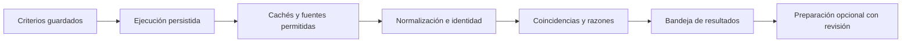

# Plan de la versión 0.8.0

Estado: implementación y validación local completadas; publicación sujeta a CI sobre el commit final. Fecha: 2026-10-04. Base: v0.7.2, commit `ee5484d6e8f38e87c7a1194c0dfc2f0cb8757f1b`.

La v0.8 debe reducir el trabajo de buscar, separar ofertas irrelevantes y decidir qué revisar. La experiencia buscada es: **indico qué empleo quiero, la app busca periódicamente y vuelvo a una lista útil, ordenada y sin repeticiones claras**. Desde esa lista puedo preparar una candidatura sin perder el contexto.

La prioridad geográfica propuesta es internacional, con país y modalidad configurables. No se asume que todas las fuentes tengan la misma cobertura por país o profesión. Esta propuesta puede ajustarse si el propietario prioriza una región.

Este documento especifica comportamiento, implementación y aceptación. Los objetivos numéricos de este plan se contrastan con los resultados y límites registrados en [la validación](v0.8.0-validation.md). La planificación no autoriza por sí sola envíos a empresas ni publicación de una nueva versión.

## 1. Punto de partida comprobado

Se revisaron el [planteamiento original](../implementation-brief.md), el [plan de v0.7.0](v0.7.0-plan.md), la [operación actual](../operations/automatic-discovery.md) y el código de v0.7.2. El documento original es contexto histórico: sus números de versión y propuesta de licencia ya fueron sustituidos por decisiones posteriores.

| Área | Situación actual | Consecuencia para v0.8 |
| --- | --- | --- |
| Búsquedas guardadas | Remotive y Arbeitnow; frecuencia de 6, 12 o 24 horas; caché compartida por proveedor | Ampliar cobertura y admitir políticas distintas por fuente |
| Puestos | `matchesSearch` exige que todas las palabras aparezcan como subcadenas del título | Evitar coincidencias como Java con JavaScript y reconocer equivalencias controladas |
| Ubicación | Texto y pocos alias; algunas regiones amplias se admiten con advertencia | Separar país, modalidad y restricciones conocidas sin inventar elegibilidad |
| Empresas seguidas | Greenhouse, Lever y Ashby tienen descubrimiento y programación propios | Incorporar sus ofertas a las búsquedas sin duplicar consultas |
| Primera búsqueda | POST guarda y espera lecturas de proveedores y parte de la preparación | Confirmar el guardado pronto, procesar en segundo plano y mostrar progreso persistente |
| Identidad de ofertas | Feeds y bolsas de empresa usan registros de origen diferentes; hay reutilización por URL en ciertos recorridos | Compartir reglas de identidad y conservar procedencia; no fusionar solo por título y empresa |
| Listado de búsqueda | Carga coincidencias y orígenes, vuelve a filtrar en memoria y después pagina | Filtrar y paginar en servidor de forma estable antes de ampliar el volumen |
| Relevancia | El encaje con el perfil y la coincidencia con la búsqueda son cálculos distintos; las habilidades reconocidas tienen sesgo técnico | Dar razones comprensibles y evaluar profesiones diversas; buscar no debe exigir un CV |
| Preparación | Ya existen preparación opcional por búsqueda, CV revisado y asistencia acotada para Lever | Mejorar qué llega a preparación, conservar revisión y evitar duplicados |

Base de regresión: v0.7.2 pasó 31 escenarios E2E generales, 10 casos límite y 175 comprobaciones automatizadas. Es la referencia que debe conservarse, no el total de pruebas que tendrá v0.8.

## 2. Alcance comprometido

### A. Encontrar mejores ofertas

- Añadir **Himalayas como primera fuente nueva**, después de comprobar el contrato real y las condiciones de integración.
- Consultar las ofertas de empresas ya seguidas y confirmadas desde las búsquedas guardadas.
- Mejorar coincidencias de puesto, país, modalidad y empresa; explicar por qué aparece una oferta.
- Separar datos ausentes de incompatibilidades comprobadas.
- Agrupar repeticiones con identidad demostrable y mantener los enlaces a todas las fuentes.

### B. Dejar trabajando la búsqueda

- Crear la búsqueda sin esperar a que respondan todas las fuentes.
- Mostrar resultados disponibles mientras continúa la consulta y distinguir errores, lectura parcial y cero coincidencias.
- Mantener programación, progreso y recuperación tras reinicios.
- Ofrecer una bandeja unificada de novedades, con búsquedas guardadas siempre visibles.

### C. Continuar con menos decisiones

- Una acción principal por estado: ver oferta, preparar candidatura, completar datos o revisar CV.
- Conservar filtros, búsqueda de origen y posición al volver.
- Aplicar límites a la preparación automática y no regenerar trabajo revisado.
- Mantener en todas las pantallas español, inglés, teclado y móvil.

**Fuera de v0.8:** nuevo motor de envíos desatendidos, otros adaptadores de escritura ATS, automatización de LinkedIn, correo, alertas externas, IA generativa, cuentas compartidas alojadas, arranque automático del sistema operativo y rediseño completo de marca. La ampliación del envío automático merece su propia versión y pruebas de autorización, duplicados y resultados inciertos.

Jobicy queda como siguiente adaptador candidato, no como dependencia para terminar esta versión. Adzuna se reserva para una integración opcional con credenciales si posteriormente se necesita su cobertura. No se añade configuración de claves al primer uso.

## 3. Recorrido de la persona usuaria

### Primer uso

1. Inicio muestra **Buscar ofertas** como acción principal. No exige completar el perfil.
2. Formulario corto: **Puesto o palabras clave**, **País o ubicación** y **Modalidad**. País es opcional; la empresa puede introducirse en una alternativa claramente visible. Debe funcionar buscar solo por empresa.
3. El texto junto al botón explica: «Buscaremos ahora y volveremos a consultar cada día mientras la app esté encendida». Opciones avanzadas: frecuencia, fuentes, términos relacionados y preparación de candidaturas. La preparación empieza desactivada.
4. Al guardar, aparece la búsqueda y su estado inmediatamente. Se muestran resultados locales disponibles y el progreso de fuentes; no se muestra «sin ofertas» mientras siga trabajando la primera consulta.
5. Cada resultado presenta puesto, empresa, ubicación/modalidad, fuente, fecha conocida y una razón breve de coincidencia. La persona puede **Ver oferta**, **Guardar** o **Descartar**; el descarte se puede deshacer.
6. **Preparar candidatura** reutiliza el perfil existente o lleva directamente al dato que falta. Después vuelve a la misma oferta o candidatura.

### Uso diario

- Al abrir, Inicio muestra un resumen de novedades desde la última revisión y de CV pendientes de revisar.
- En Buscar empleo: **Todas las búsquedas** y tarjetas de cada búsqueda con nombre, novedades y estado activo/pausado. No esconder búsquedas anteriores dentro de un selector.
- Filtro de resultados por **Nuevas**, **Todas** y **Guardadas**; las descartadas quedan en una vista recuperable secundaria.
- Orden predeterminado: coincidencia con la búsqueda; alternativa: fecha de publicación conocida. «Encontrada hoy» no sustituye a una fecha de publicación ausente.
- Las nuevas llegadas actualizan un aviso «Hay nuevas ofertas». No desplazan filas, el foco o la página que se está leyendo hasta que se pulse ese aviso.
- Si todo fue revisado, decir «Estás al día» y mostrar la siguiente consulta prevista.
- Mantener `/boards`, `/jobs` y enlaces existentes; Empresas que sigo sigue disponible como ampliación opcional de cobertura. No añadir otra pantalla que la persona deba configurar obligatoriamente.

### Estados y acciones visibles

| Estado | Mensaje propuesto | Acción |
| --- | --- | --- |
| Primera búsqueda en cola | «Tu búsqueda está guardada. Estamos preparando la consulta» | Ver progreso o continuar usando la app |
| Una fuente respondió | «Ya puedes revisar estas ofertas; seguimos consultando otras fuentes» | Revisar resultados |
| Todas respondieron sin coincidencias | «No encontramos coincidencias en las fuentes consultadas» | Cambiar un filtro o ver términos relacionados |
| Fuente fallida con resultados previos | «Una fuente no respondió. Conservamos los resultados anteriores» | Ver última consulta y próximo intento |
| Ninguna fuente respondió | «No pudimos completar la búsqueda» | Reintentar cuando sea posible; conservar criterios |
| Límite de páginas o peticiones | «La búsqueda cubrió parte de los resultados disponibles» | Acotar criterios; mostrar cobertura |
| Servicio retomado | «Retomamos tus búsquedas pendientes» | Mostrar actividad real |
| Búsqueda pausada | «Las consultas automáticas están pausadas» | Reanudar; consultar una vez si la fuente permite hacerlo |
| Ubicación desconocida | «Comprueba desde qué países se puede trabajar» | Revisar anuncio original |

No ofrecer «Reintentar ahora» cuando siga vigente una espera del proveedor. Comprobar resultados locales nunca debe simular una nueva lectura de internet.

## 4. Fuentes y cobertura

Revisión documental realizada el 2026-10-04. No se hicieron lecturas de ofertas reales durante esta planificación ni se verificó todavía un adaptador nuevo.

| Fuente | Decisión | Fundamento y límite |
| --- | --- | --- |
| Remotive | Conservar | Feed remoto con atribución, retraso de publicación y límites documentados; mantener caché compartida. [Documentación](https://github.com/remotive-com/remote-jobs-api) |
| Arbeitnow | Conservar | Mantener el adaptador actual y su indicador de cobertura cuando se alcanza el límite de páginas. Su presencia no implica cobertura mundial |
| Greenhouse, Lever, Ashby | Reutilizar empresas confirmadas | Consumir las ofertas locales y respetar su programación y permisos existentes. No consultar una empresa desconocida por adivinar su identificador |
| Himalayas | Integrar en v0.8 | API pública sin clave, búsqueda por criterios y datos de restricciones geográficas. Requiere atribución y describe actualización cada 24 horas. [Documentación](https://himalayas.app/docs/remote-jobs-api) |
| Jobicy | Siguiente candidato | Feed público sin clave, con ventana temporal y paginación. La documentación separa enlaces públicos de enlaces ATS comerciales; no debe prometerse un destino directo gratuito. [Documentación](https://jobicy.com/jobs-rss-feed) |
| Adzuna | Posponer | Requiere `app_id` y `app_key`; añade una configuración ajena al recorrido inicial. [Documentación](https://developer.adzuna.com/overview) |

Antes de programar Himalayas, fijar una copia de los contratos esperados, ejemplos sintéticos, campos obligatorios, formatos de fecha y paginación de cada endpoint. Su documentación presenta ejemplos de fechas en formatos distintos: resolver esa diferencia con el contrato y una comprobación acotada, no por suposición.

**Política propuesta del adaptador:** búsqueda dirigida y caché por consulta normalizada durante 24 horas; no descargar un catálogo entero por instalación. Máximo inicial de 3 páginas por consulta remota, 2 variantes por búsqueda y 100 peticiones al día por instalación para esta fuente; una petición simultánea por host. Son límites conservadores de nuestra app, no cuotas concedidas por el proveedor. Si el límite se alcanza, persistir el estado y explicar cobertura parcial. Un `Retry-After` más largo prevalece.

Registrar límites y cadencias por proveedor, en vez de aplicar seis horas a todos. Los feeds completos de Remotive/Arbeitnow siguen compartidos y se filtran localmente. Las empresas confirmadas se leen una sola vez según su agenda; una búsqueda guardada no crea un segundo lector de la misma bolsa.

No convertir automáticamente el nombre libre de una empresa en un slug de Himalayas o de un ATS. Usar un identificador conocido y verificado cuando exista; en otros casos buscar por texto y filtrar localmente. Explicar cuando una empresa no está cubierta.

Antes de activar la nueva fuente en una instalación existente, mostrar qué criterios se enviarán a ella —puesto, empresa y país si se usan— y permitir incorporarla a las búsquedas existentes. No se transmite el CV ni los datos de contacto para buscar. Las búsquedas antiguas conservan sus fuentes hasta esa elección. En búsquedas nuevas, las fuentes recomendadas se muestran junto a la acción de guardar.

**Puerta de decisión:** si el contrato real, las condiciones o la calidad de Himalayas impiden una integración útil, detener ese bloque y presentar la alternativa con evidencia. No declarar entregada la ampliación de cobertura usando únicamente un adaptador simulado.

## 5. Reglas de relevancia

### Puestos y empresas

- Usar tokens completos y normalización de acentos; conservar significado de `C++`, `C#`, `.NET` y términos compuestos. Java no debe coincidir con JavaScript por subcadena.
- Diccionario pequeño y versionado de equivalencias ES/EN, con pruebas por entrada. Empezar por calidad de software, desarrollo, diseño, soporte, marketing y administración; cualquier otra profesión sigue admitiendo búsqueda textual.
- Separar equivalencias claras de puestos relacionados. `SDET` puede expandirse a su nombre completo; `QA` no equivale automáticamente a cualquier puesto de automatización. Mostrar una sugerencia de ampliación que la persona pueda activar o desactivar.
- Seniority no es un sinónimo: junior y senior permanecen distintos. El título breve no basta para inferir años de experiencia.
- Empresa: normalización y nombres alternativos respaldados por datos; nunca unir empresas distintas por coincidencia parcial de nombres.
- Las búsquedas existentes conservan la versión de sus reglas hasta que se revisen los criterios o se acepte la mejora. No ampliar silenciosamente una búsqueda que tiene preparación automática activada.

### Ubicación

- Guardar país como código cuando se elija del selector y conservar el texto original para ciudades o regiones no resueltas.
- Separar modalidad de restricciones de residencia. «Remoto» no significa «desde cualquier país».
- Prioridad de evidencia: campo estructurado de la fuente; regla determinista con evidencia de texto; desconocido.
- Una lista explícita y excluyente de países puede indicar incompatibilidad geográfica. Texto ambiguo o una mención incidental a otro país sigue como desconocido.
- No calcular autorización legal para trabajar a partir de nacionalidad, ubicación o palabras de la oferta.
- Mantener desconocidos visibles y explicados por defecto; el filtro estricto es una elección explícita. No pedir todos estos datos al iniciar una búsqueda.
- Distinguir criterio no solicitado de criterio desconocido: si no se eligió país o modalidad, no inventar una incompatibilidad ni bloquear por ese filtro ausente. La residencia permitida por el anuncio puede seguir requiriendo revisión antes de preparar automáticamente.

### Orden y explicación

Separar **coincidencia con lo que buscas** de **evidencia de tu perfil**. La primera funciona sin perfil. La segunda solo usa hechos confirmados y no se presenta como probabilidad de contratación.

Orden propuesto: cumplimiento de filtros explícitos → puesto exacto o equivalente → coincidencia textual parcial/relacionada permitida → ubicación comprobada frente a desconocida → publicación conocida reciente → ID estable. Las preferencias opcionales no deben convertirse en requisitos ocultos. Mostrar hasta dos razones claras y los datos que falten. La explicación completa queda disponible al abrir la oferta.

Guardar `matcherVersion`, revisión de criterios y razones estructuradas. Un cambio de idioma solo traduce etiquetas; no cambia el conjunto de resultados. Cambiar preferencias del perfil no debe modificar silenciosamente los criterios de una búsqueda guardada.

## 6. Identidad, novedades y conservación de decisiones

- Identidad fuerte: proveedor + región/bolsa + ID externo; o identificador ATS y destino oficial coincidentes; o URL canónica comprobada con parámetros puramente de seguimiento eliminados mediante reglas explícitas.
- Empresa, título y ciudad parecidos solo generan una posible relación. No bastan para ocultar otra vacante, cerrar un registro ni compartir automáticamente una candidatura.
- Para coincidencias fuertes, mostrar una tarjeta y varias procedencias. Mantener fechas y estado por fuente, y mostrar de dónde viene cada afirmación.
- Separar «publicada», «encontrada por esta búsqueda» y «última comprobación». Una consulta desde caché no renueva la fecha de verificación en la fuente.
- Las ofertas nuevas de una búsqueda son las incorporadas después de su revisión anterior; sus contadores no dependen solo de cuándo el registro global entró en la instalación.
- Archivar, guardar, revisar y deshacer deben sobrevivir a nuevas lecturas, cambios de orden y actualizaciones de texto.
- No cerrar una oferta por desaparecer de un feed paginado, temporal o fallido. Una fecha de expiración se muestra como información de la fuente y no modifica solicitudes existentes.

Para registros históricos duplicados, usar agrupaciones reversibles con miembros y evidencia. No borrar IDs, PDFs, notas ni solicitudes para fusionarlos. Los enlaces antiguos siguen abriendo su registro. Si ya hay dos candidaturas o decisiones manuales distintas, conservar ambas y señalar el conflicto; bloquear una tercera preparación automática del grupo hasta resolverlo.

Los jobs nuevos con identidad fuerte reutilizan el registro bajo transacción. El descubrimiento por empresa y por búsqueda debe llamar a la misma operación de identidad antes de insertar. Las pruebas deben cubrir dos trabajadores descubriendo simultáneamente la misma vacante.

Las acciones sobre una tarjeta agrupada explican su alcance y actualizan los miembros en una transacción, conservando el estado anterior para deshacer. Si el historial contiene decisiones contradictorias, se muestran por separado hasta resolverlas; no elegir silenciosamente entre archivada y guardada. Una nueva procedencia de la misma vacante hereda la decisión ya tomada para esa identidad, sin volver a presentarla como una vacante nueva.

## 7. Procesamiento y cambios técnicos

### Ejecución persistente

- POST crea la búsqueda y una ejecución en cola en una transacción; devuelve `201` con búsqueda y `runId`. La solicitud no espera a internet ni a la generación de PDF.
- Un identificador de idempotencia del cliente evita duplicados al repetir un guardado tras perder la respuesta. PATCH exige `expectedRevision` para detectar edición desde otra pestaña.
- Cada ejecución fija revisión de criterios, versión del comparador y fuentes autorizadas. Sus resultados no pueden reemplazar los de una revisión posterior.
- Estados propuestos: `QUEUED`, `RUNNING`, `PARTIAL`, `SUCCEEDED`, `FAILED`, `CANCELLED`. Guardar progreso y errores por fuente. `PARTIAL` debe distinguir trabajo aún en curso de una ejecución terminada con cobertura incompleta mediante `finishedAt`.
- Reutilizar PostgreSQL y el proceso actual de planificación. Una reserva con vencimiento, propietario y comprobación de vigencia protege cada ejecución; no introducir Redis, otro servicio ni una cola externa como requisito.
- Reiniciar recupera una consulta vencida una vez, respeta presupuestos/cooldowns y descarta publicaciones tardías del trabajador anterior. Los intervalos perdidos no se ejecutan en ráfaga.
- Pausar evita nuevas consultas y nuevas preparaciones. Una lectura de red ya iniciada puede terminar; sus datos públicos se pueden almacenar, pero no inicia otra fase después de la pausa. Consultar una vez queda disponible respetando límites de fuente.
- Guardar el resultado de cada fuente conforme llegue, sin esperar a la más lenta. Un fallo no borra éxitos de otras fuentes.
- Distribuir el presupuesto del proveedor entre búsquedas pendientes con orden justo y consultas idénticas agrupadas. Una búsqueda amplia no puede consumir todas las peticiones y dejar las demás sin consultar permanentemente. Las empresas con permiso vencido o desactivadas no generan nuevas lecturas; sus resultados previos se muestran con su antigüedad.

### Modelo de datos propuesto

| Cambio | Propósito y condición |
| --- | --- |
| Revisión y versión de criterios en búsquedas | Conflictos entre pestañas y resultados asociados a los criterios correctos |
| `search_runs` y `search_run_sources` | Progreso, reservas, intentos, cobertura, fechas y motivos de error |
| Caché por proveedor y hash de consulta | Permitir feeds globales y consultas dirigidas; sin identidad del candidato en cachés compartidas |
| Orígenes normalizados | Vista/servicio común sobre `job_occurrences` y `job_search_sources`; conservar sus IDs y referencias durante la migración |
| Agrupaciones de ofertas y evidencia de identidad | Deduplicación reversible y comprobación previa a la preparación |
| Coincidencias materializadas por búsqueda/revisión | Filtro, razones y orden paginados sin cargar todo el historial en memoria |
| Estado de revisión por búsqueda y oferta | Contar novedades correctamente aunque la oferta ya exista en otra búsqueda |

API aditiva: conservar contratos usados por pantallas anteriores; añadir estado de ejecución y filtros versionados. La nueva paginación debe ofrecer total y orden estable; la llegada de resultados nuevos no altera la página hasta actualizar. Un cursor o versión de resultados identifica la vista que está recorriendo la persona.

Partes principales a modificar: `apps/api/src/job-search*.ts`, `discovery.ts`, `application-preparation.ts`, `packages/domain/src/matching.ts`, esquema/migraciones, `/searches`, Inicio, detalle de oferta y componentes de preparación. Extraer tarjetas, formulario y progreso de la página grande de búsquedas para evitar concentrar toda la lógica nueva en un solo componente.

### Límites y mantenimiento

- Mantener límites de tamaño, tiempo, páginas y redirecciones por adaptador; validar datos antes de persistirlos y seguir convirtiendo descripciones a texto seguro.
- Las nuevas consultas usan cachés separadas del historial personal. Eliminar cachés de consulta sin uso durante siete días y actividad operativa detallada de más de treinta días; conservar los resúmenes de última consulta. No aplicar ese borrado a ofertas guardadas, documentos o candidaturas.
- Los contadores de tiempos y resultados permanecen locales, sin telemetría externa por defecto ni criterios personales en logs públicos.
- Separar intervalo pedido por la persona de la siguiente lectura posible de cada fuente. Una búsqueda cada seis horas puede reutilizar una fuente que se actualice diariamente.

## 8. Continuación hacia la candidatura

La preparación automática sigue siendo optativa. Para búsquedas nuevas, al activarla se explica qué hará y se fija un límite inicial de **cinco candidaturas por pasada y diez al día por instalación**. Es un límite de trabajo local, no de envíos. Las búsquedas migradas muestran y permiten revisar el nuevo límite antes de usar fuentes o criterios ampliados.

Solo entran resultados que cumplen los criterios explícitos, no están descartados, tienen descripción utilizable y carecen de otra preparación/candidatura protegida para su identidad. Los resultados relacionados sugeridos o de ubicación desconocida quedan para revisión antes de prepararse automáticamente. Un perfil incompleto crea una indicación de qué falta, sin repetir errores por cada tick.

La cola respeta prioridad, pausa y equidad entre búsquedas. Cambiar idioma o reabrir una oferta no genera PDFs. Dos fuentes o dos búsquedas que encuentran la misma vacante fuerte no crean dos candidaturas. Revisiones de perfil, PDF aprobado, documento elegido por el usuario, solicitud cerrada y envío incierto mantienen las protecciones de v0.7.2.

Enlace principal según estado:

| Situación | Acción |
| --- | --- |
| Solo oferta | Preparar candidatura |
| Faltan datos | Completar los datos que faltan |
| Borrador preparado | Revisar CV |
| CV revisado y solicitud existente | Continuar candidatura |
| Solicitud enviada, cerrada o incierta | Ver seguimiento o revisar resultado |

Encontrar una oferta y preparar su CV no autorizan transmitir datos ni enviar un formulario.

## 9. Tareas y dependencias

Cada tarea debe entregar código, pruebas pertinentes y documentación de sus límites. Tamaño relativo: S pequeño, M medio, L grande; no son estimaciones de calendario.

| ID | Entrega | Depende de | Tamaño | Criterio de cierre |
| --- | --- | --- | --- | --- |
| T01 | Contrato de fuentes, casos de relevancia y mapa de pantallas | — | M | Contrato Himalayas documentado, lectura acotada viable, matriz de cobertura y fixtures etiquetados antes de ajustar reglas |
| T02 | Contratos compartidos y migraciones aditivas | T01 | L | IDs y decisiones conservados; aislamiento por workspace; actualización desde copia ficticia v0.7.2 |
| T03 | Guardado rápido y ejecuciones persistidas | T02 | L | Reintento idempotente, progreso parcial, recuperación tras crash y descarte de revisión antigua |
| T04 | Adaptador Himalayas y presupuestos por fuente | T01, T02, T03 | M | Contratos, atribución, caché, límites y errores probados; comprobar lectura real antes de habilitar |
| T05 | Normalización de países, puestos y razones de búsqueda | T01, T02 | L | Casos ES/EN positivos y negativos; métricas del conjunto reservado cumplen los objetivos |
| T06 | Identidad común y agrupaciones reversibles | T02 | L | Concurrencia, falsas similitudes, enlaces antiguos y candidaturas existentes protegidos |
| T07 | Incluir empresas confirmadas y resultados paginados | T03, T05, T06 | M | Una consulta por empresa y agenda; resultados combinados, orden estable y sin lectura masiva en memoria |
| T08 | Primer uso, tarjetas de búsquedas y bandeja diaria | T03, T04, T05, T07 | L | Recorrido sin perfil obligatorio, estados claros, contexto al volver y todos los tamaños/idiomas |
| T09 | Preparación limitada por relevancia e identidad | T05, T06, T07 | M | Una preparación por identidad, cupos, pausa, equidad y revisión intacta |
| T10 | Migración, exportación, restauración y métricas locales | T02, T03, T06, T09 | M | Restaurar nunca reanuda consultas, preparaciones o envíos; datos nuevos incluidos y cachés privadas excluidas |
| T11 | Revisión integrada de usabilidad y fallos | T04–T10 | L | E2E completos, evaluación de relevancia, fallos inducidos y recorrido de primera vez sin bloqueo |
| T12 | Cierre y publicación v0.8.0 | T11 | M | Build, CI, documentación, main, tag anotado, release Latest y SHA remoto verificados |

Orden práctico de integración: contratos → búsqueda persistida con fuentes actuales → nueva fuente → relevancia e identidad → bandeja y continuación → migración y cierre. T05 y T06 pueden desarrollarse de forma independiente tras estabilizar contratos; no delegar cambios simultáneos al mismo esquema sin acordar quién lo integra.

Cuatro puntos de revisión antes de avanzar:

1. **Diseño y contratos:** revisar el formulario, los estados de espera/error y ejemplos concretos de resultados; comprobar viabilidad de la fuente. Salida de T01, antes de migraciones.
2. **Búsqueda real:** crear una búsqueda, recibir resultados parciales y retomarla tras reiniciar con las fuentes actuales y la nueva. T02–T04.
3. **Relevancia y recorrido:** demostrar filtros, razones, identidad, bandeja y continuación con casos positivos y negativos. T05–T09.
4. **Candidato a release:** congelar alcance funcional y completar migración, pruebas integradas, documentación y publicación. T10–T12.

Himalayas, la integración de empresas ya seguidas, relevancia, identidad, recorrido y migración forman el mínimo de v0.8. No sustituir silenciosamente uno por una tarea opcional. Si aparece un bloqueo que exige reducirlo, registrar el motivo y revisar el alcance con el propietario antes de presentar la versión como completa. Jobicy, más familias de equivalencias y filtros especializados pueden ir después sin retrasar este mínimo.

Si se usa Orca al implementar, la división aconsejada es fuentes/ejecuciones, relevancia/identidad y frontend/recorrido; la integración de esquema, restauración y release tiene un único responsable. Este plan no inicia trabajadores ni asigna un modelo.

## 10. Cómo demostrar que mejora

### Calidad de resultados

Antes de cambiar reglas, preparar al menos 120 casos sintéticos revisados manualmente, repartidos entre seis familias de puestos, ES/EN, distintas regiones y datos incompletos. Separar al menos 40 como conjunto reservado y no ajustar reglas mirando sus fallos repetidamente. Medir v0.7.2 y v0.8 sobre los mismos casos.

Objetivos propuestos:

- Al menos 80% de relevancia media entre los primeros diez resultados de las búsquedas evaluables, y ninguna familia por debajo de 70%; informar también cobertura de los casos, no solo el promedio.
- Al menos 90% de recuperación de equivalencias inequívocas etiquetadas. Los puestos solo relacionados se evalúan por separado.
- Cero falsos positivos en los casos negativos obligatorios Java/JavaScript, empresas homónimas y países explícitamente excluidos.
- Cero fusiones incorrectas en el conjunto de identidad; el 100% de duplicados con identidad fuerte de las fixtures debe agruparse. No se promete detectar todos los duplicados reales.
- Si una métrica empeora frente a la base, revisar el cambio o justificar una decisión de producto antes de publicar. No rebajar objetivos después de observar fallos sin registrar por qué.

### Usabilidad

- Recorrido inicial con un puesto y un clic en buscar; país/modalidad opcionales, sin configurar empresas ni CV.
- Confirmación visual del guardado inmediatamente tras la respuesta; nunca una pantalla vacía mientras la ejecución continúa.
- Una acción principal reconocible en resultado, detalle y candidatura.
- Teclado completo, foco visible, mensajes asociados a campos, actualizaciones anunciadas sin robar foco y ninguna información dependiente solo del color.
- Sin desbordamiento horizontal a 320, 390, 768, 1096 y 1440 px; zoom de 200%; ES/EN, nombres largos y fechas locales.
- Recorrido de evaluación con tres personas nuevas si están disponibles: encontrar, revisar, guardar y preparar una oferta sin instrucciones del evaluador. Objetivo: al menos dos de tres completan el recorrido sin ayuda. Si solo se hace inspección experta, documentarlo y no presentarlo como prueba con usuarios.

### Rendimiento

Sobre un entorno local documentado con 10.000 ofertas normalizadas y 20 búsquedas ficticias: POST de guardado y primera página local con p95 inferior a un segundo, medidos en al menos 30 repeticiones después del calentamiento. La latencia externa se mide aparte y nunca es condición para confirmar el guardado.

No prometer resultados de internet en un tiempo fijo. Con una fuente lenta simulada, las otras deben poder mostrarse primero; tras treinta segundos la UI conserva progreso y explica la espera. Consultas y DOM deben crecer según el tamaño de página, no según el historial total.

## 11. Matriz de fallos obligatoria

1. Guardado doble, respuesta perdida y reintento: una búsqueda y una ejecución lógica.
2. Edición en dos pestañas y resultado antiguo tardío: conflicto explícito, sin sobrescritura.
3. Primera consulta sin caché, con caché válida y con caché antigua: mensajes distintos y fechas reales.
4. Fuente vacía, timeout, 429, 5xx, HTML en vez de JSON, fila inválida, cambio de esquema y fecha imposible.
5. Última página fallida, cursor repetido/expirado y presupuesto agotado: cobertura parcial y sin cierre de ofertas.
6. Reinicio antes de consultar, después de recibir datos y antes de confirmar transacción: no duplicar registros ni perder intervalos.
7. Pausa durante consulta y durante cola de preparación; trabajador con reserva vencida.
8. Misma vacante en dos fuentes, dos búsquedas y una empresa seguida, incluidas llegadas simultáneas.
9. Mismo título en distintas sedes, empleadores homónimos y republicación con nuevo ID: no fusionar por parecido.
10. Ubicación ausente, remoto de un solo país, global con restricciones horarias, modalidad desconocida y datos contradictorios entre fuentes.
11. Perfil vacío, preferencias distintas de la búsqueda y hechos sin confirmar: resultados útiles sin inventar encaje.
12. Oferta revisada, guardada o archivada que vuelve a aparecer; deshacer y cambios desde otra pestaña.
13. Llegadas en segundo plano mientras se lee la segunda página: conservar foco, posición y selección.
14. Búsqueda por empresa sin puesto, puesto no técnico, alias ES/EN, acentos y términos de hasta 200 caracteres.
15. Varios CV, documento elegido manualmente, candidatura cerrada o incierta: no regenerar ni duplicar preparación.
16. Migración y restauración v0.7.2/v0.8: mantener datos y dejar toda automatización restaurada desactivada, incluidas ejecuciones pendientes nuevas.
17. Acceso a búsquedas, ejecuciones, grupos y fuentes de otro workspace: denegado.
18. Pruebas completas existentes y nuevas en un entorno desechable, sin escribir en el espacio real ni enviar a empleadores.

## 12. Migración y publicación

Las migraciones serán aditivas y conservarán versiones de reglas, frecuencias, fuentes autorizadas y decisiones existentes. No activar la nueva fuente ni ampliar criterios de búsquedas anteriores automáticamente. Construir coincidencias derivadas de forma gradual; mientras se recalculan, mantener legibles los resultados antiguos y evitar preparación sobre una revisión incoherente.

Añadir los datos nuevos a la exportación revisada y a las comprobaciones de backup/restore. La restauración debe cancelar ejecuciones pendientes y reservas, pausar agendas y preparación y conservar la protección de intentos de envío inciertos. La caché de consultas no es requisito para recuperar el historial.

Antes de migrar una instalación real, crear y verificar un respaldo. Una migración de esquema no garantiza compatibilidad con el binario anterior: documentar recuperación mediante respaldo en un destino aislado. Para un fallo de proveedor, preferir desactivar ese adaptador conservando resultados a revertir toda la base.

### Notas de implementación respecto al plan

- Himalayas usa una consulta canónica por búsqueda (dentro del máximo propuesto de dos variantes), preservando modificadores y verificando localmente los criterios completos.
- El conjunto original de 144 casos informó el desarrollo y sus etiquetas de partición se conservan solo por reproducibilidad. Se añadieron 48 casos prospectivos, repartidos entre las seis familias, con expectativas fijadas tras congelar el comparador; pasaron en la primera ejecución sin ajustar las reglas. Son comprobaciones sintéticas; no constituyen un estudio independiente con anuncios reales.
- Se comprobó reflujo con texto al 200% y cinco anchos de pantalla. No se presenta como zoom nativo verificado en todos los navegadores. No hubo participantes nuevos disponibles; la revisión combina inspección y automatización.

Puertas de cierre:

- [x] T01–T10 cumplen sus criterios; ninguna simulación se anuncia como integración verificada.
- [x] Relevancia, identidad, rendimiento y estados de UX tienen evidencia y limitaciones anotadas.
- [x] Suite general y casos límite completos pasan sobre el código final; una repetición dirigida no sustituye una ejecución completa.
- [x] Migración, exportación y restauración comprobadas con datos ficticios, también desde v0.7.2.
- [x] Lint, tipos y build local aprobados; CI conserva pruebas en Linux y Windows. El alcance del arranque nativo queda documentado.
- [x] Versiones de paquetes y `RELEASE_VERSION`, README ES/EN, changelog, cobertura de fuentes y notas de release alineados.
- Puerta remota de publicación: CI del commit aprobado antes de actualizar main; tag anotado `v0.8.0` sobre ese SHA y GitHub Release Latest. El registro de GitHub y la respuesta de cierre documentan la comprobación de referencias remotas y URL.
- [x] Repositorio privado hasta autorización explícita de publicación pública; pruebas y datos personales fuera del commit.

La versión se cierra cuando mejora el recorrido completo y cumple estas puertas. Los defectos que impidan buscar, revisar o continuar bloquean la release; añadir más fuentes después no compensa esos fallos.
