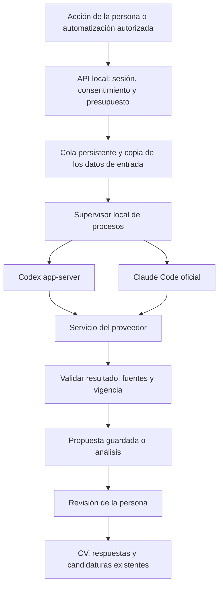

# Plan de la versión 0.9.0

**Estado:** implementación iniciada en `release/v0.9.0`; G0 pendiente. **Fecha:** 2026-10-04. **Base:** v0.8.2, commit `be27bcbfd5b69a786aa0bdfcab5f13ba9907fbfa`.

### Avance de la primera tanda

- T00: inspección de sesión de los programas oficiales y diagnósticos normalizados implementados. El aislamiento de inferencia todavía no está demostrado. Decisiones [Codex](../decisions/017-codex-feasibility.md) y [Claude Code](../decisions/016-claude-code-feasibility.md).
- T01: contratos, permisos por operación/datos, validación de referencias, vigencia de textos derivados, aprobación ligada al PDF y reglas puras de presupuesto implementados; todavía sin rutas ni persistencia.
- T03: supervisor común con límites de salida, cancelación, timeout y pruebas sintéticas implementado. El adaptador de inferencia sigue pendiente de G0.
- Consulta de alcance pendiente: Codex primero con Claude aplazado, o evaluar Claude mediante API con facturación independiente. No se ha cambiado el alcance objetivo por silencio.
- La aplicación instalada sigue en v0.8.2 y no ofrece inferencia de IA. No se ejecutaron migraciones sobre los datos reales ni se publicó una versión nueva.

El detalle de las comprobaciones y sus límites se mantiene en [validación de v0.9.0](v0.9.0-validation.md).

## 1. Resultado que buscamos

**«Digo qué empleo busco, la app encuentra ofertas automáticamente y mi asistente me ayuda a entenderlas y preparar una candidatura que puedo revisar.»**

La v0.9.0 incorpora IA opcional usando asistentes oficiales instalados en el equipo. El objetivo es aprovechar la cuenta que la persona ya utiliza, con una conexión comprensible y control sobre el consumo. Career Stack seguirá funcionando sin conectar un asistente.

La experiencia de Orca sirve como referencia. Orca no será una dependencia para quienes instalen Career Stack. Tampoco se introduce un chat genérico que obligue a aprender a escribir instrucciones.

La versión se divide en tres entregables:

1. **Conectar y controlar:** Codex y Claude Code, conexión oficial, estado real, información de uso cuando esté disponible y desconexión clara.
2. **Encontrar y entender:** convertir una petición en criterios revisables y resumir ofertas con referencias al anuncio y al perfil.
3. **Preparar y revisar:** proponer textos del CV y respuestas con evidencia; permitir análisis automático de novedades con límites.

Este plan define trabajo futuro. No cambia la versión instalada ni autoriza por sí mismo consumo de cuentas, aceptación de condiciones de terceros, envíos a empresas o publicación del repositorio.

## 2. Punto de partida comprobado

| Área | Estado en v0.8.2 | Trabajo de v0.9.0 |
| --- | --- | --- |
| Búsqueda periódica | Fuentes públicas, búsquedas guardadas, empresas seguidas, resultados persistentes y deduplicación | Reutilizar el motor; añadir ayuda para expresar criterios y comprender resultados |
| Encaje | Reglas explicables | Mantenerlo como referencia; mostrar el análisis de IA por separado |
| Perfil | Datos, experiencia y respuestas versionadas, con aprobación | Compartir solo la selección necesaria y conservar su versión |
| Preparación | Generación determinista de candidaturas a partir de datos aprobados | Añadir propuestas de redacción y respuestas, sin sustituir información confirmada |
| CV | PDF, versiones, revisión y detección de contenido desactualizado | Incorporar procedencia de textos derivados y conservar la compatibilidad de PDF existentes |
| Asistencia de solicitudes | Flujo acotado para Lever; autorización de cada envío | Mantener su autorización independiente de la IA |
| IA | No hay adaptador operativo; las capacidades públicas indican que no está disponible | Implementar conexión, ejecución, contratos y estados |
| Contabilidad | Existe `llm_usage`, sin integración operativa encontrada | Integrarla con ejecuciones y consumo observado, sin inventar costes |
| Privacidad | Instalaciones locales separadas; mensajes «Local y privado» | Explicar almacenamiento local y procesamiento externo cuando se active IA |

Referencias principales del repositorio:

- [Esquema de datos](../../packages/db/src/schema.ts), [contratos](../../packages/domain/src/contracts.ts) y [vigencia de documentos](../../packages/domain/src/documents.ts).
- [Preparación de candidaturas](../../apps/api/src/application-preparation.ts), [ejecución de búsquedas](../../apps/api/src/search-execution.ts), [API y capacidades](../../apps/api/src/server.ts).
- [Ajustes](../../apps/dashboard/app/settings/page.tsx), [navegación y mensajes de privacidad](../../apps/dashboard/components/shell.tsx), [recuperación de copias](../operations/backup-restore.md).

**Invariante importante:** la vigencia de un CV depende de la identidad impresa y de sus fuentes. En revisiones posteriores, el código compara el texto impreso con el de los datos actuales; en la misma revisión admite fuentes directas. Una redacción de IA requiere un contrato explícito de texto derivado. No basta con añadir identificadores de experiencia y dar el PDF por válido.

## 3. Viabilidad de las conexiones

### 3.1 Lo verificado y lo que falta demostrar

| Capacidad | Codex | Claude Code |
| --- | --- | --- |
| Transporte propuesto | `codex app-server`, comunicación local por stdio | Binario oficial, ejecución programática con `-p` |
| Inicio de sesión | Flujo oficial administrado por app-server | Inicio de sesión propio de Claude Code |
| Identificar conexión | Estado de cuenta publicado por el protocolo | `claude auth status`, normalizado y sin exponer credenciales |
| Resultado estructurado | Esquema por turno | JSON y esquema de salida |
| Consumo de suscripción | Ventanas de límites publicadas por app-server | No se ha verificado una interfaz estable equivalente para esta integración |
| Cancelación | Interrupción de turno y cierre supervisado | Terminación supervisada del proceso y sus descendientes |
| Aislamiento de herramientas y configuración | Debe probarse con la versión elegida | Debe probarse; desactivar herramientas nativas no desactiva por sí solo MCP |
| Compatibilidad real por sistema operativo | Pendiente de prueba de integración | Pendiente de prueba de integración |

El protocolo de Codex documenta `account/login/start`, cancelación y notificaciones de login, `account/rateLimits/read`, `thread/start`, `turn/start`, `turn/interrupt` y `outputSchema`. Se usará autenticación administrada por el agente. [Referencia oficial de app-server](https://learn.chatgpt.com/docs/app-server).

Claude Code documenta ejecución programática y opciones de salida estructurada. Su CLI distingue herramientas disponibles de herramientas preautorizadas: `--allowedTools` no es una lista exclusiva. El adaptador deberá comprobar también MCP, hooks y configuración heredada. [Ejecución programática](https://code.claude.com/docs/en/headless), [referencia CLI](https://code.claude.com/docs/en/cli-reference).

Anthropic contempla ejecutar el binario original dentro de productos con condiciones específicas, autenticación individual y términos aplicables. También restringe ofrecer login de Claude.ai o intermediar sus credenciales desde aplicaciones de terceros. El diseño debe ajustarse al uso del binario oficial; el hecho de que Orca muestre consumo no resuelve por sí mismo esa distinción. La tarea T00 debe registrar el encaje del flujo concreto antes de presentarlo como soportado. [Condiciones y autenticación](https://code.claude.com/docs/en/legal-and-compliance).

### 3.2 Decisiones propuestas

- **Codex primero**, seguido de Claude Code sobre el mismo contrato. La salida objetivo de v0.9.0 incluye ambos adaptadores verificados; un bloqueo de uno requiere una decisión explícita de alcance antes de cerrar la versión.
- Usar el login del agente oficial. Career Stack no solicita contraseñas ni copia tokens desde archivos, llaveros del sistema u otras aplicaciones.
- Admitir una conexión activa por proveedor y un asistente predeterminado. No incluir rotación de cuentas ni reparto automático entre suscripciones.
- Detectar el método de autenticación efectivo. Una cuenta por suscripción y una configuración de API con cobro independiente deben distinguirse antes de ejecutar.
- Conservar los métodos de autenticación del binario original. v0.9.0 no añade un almacén propio de claves API ni sustituye los mecanismos de login del proveedor.
- Diseñar el contrato para futuros proveedores; implementar más proveedores se aplaza.
- `Sign in with ChatGPT` para aplicaciones y la autenticación nativa de Codex son rutas distintas. La primera queda como alternativa futura, con su propia evaluación de elegibilidad y limitaciones; no mezclar sus contratos. [Guía oficial de esa integración](https://developers.openai.com/cookbook/articles/sign-in-with-chatgpt).

En este equipo se observaron `codex-cli 0.160.0` y Claude Code `2.1.289`. Son versiones candidatas para T00, no versiones mínimas ya certificadas. La ayuda local de app-server lo identifica como experimental; fijar la compatibilidad del protocolo y detectar cambios será obligatorio.

### 3.3 Puerta de entrada G0

Antes de construir las pantallas definitivas, demostrar para cada proveedor:

1. Login y detección de cuenta mediante interfaces oficiales, incluyendo cancelación y sesión caducada.
2. Ejecución con datos sintéticos, salida estructurada y evento final inequívoco.
3. Configuración verificada que impida al modelo ejecutar herramientas, cargar instrucciones personales o leer archivos ajenos al contenido entregado para la tarea.
4. Separación entre autorización de Career Stack y sesión global del agente; documentar cualquier efecto compartido.
5. Cancelación efectiva, limpieza de procesos y ausencia de secretos en logs, argumentos y respuestas HTTP.
6. Método de autenticación y consumo identificados, o limitación explícita donde no exista información soportada.
7. Flujo de integración compatible con las condiciones documentadas del proveedor; resolver ambigüedades antes de distribuirlo.

Si un requisito crítico no puede cumplirse, no sustituirlo por extracción de tokens, endpoints privados o permisos amplios. Registrar el bloqueo y proponer el cambio mínimo de alcance. Las pruebas reales consumirán exclusivamente cuentas de prueba autorizadas para esa validación.

## 4. Alcance funcional

### Incluido

- Conectar un asistente desde Ajustes o desde una acción contextual, con retorno al trabajo pendiente.
- Mostrar si está instalado, conectado, preparado para trabajar, limitado o desconectado.
- Presentar consumo observado y fecha de actualización cuando el proveedor lo permita.
- Interpretar «Busco trabajo de QA remoto en España» y mostrar criterios editables antes de guardar.
- Resumir una oferta y explicar coincidencias, requisitos pendientes y datos desconocidos.
- Proponer redacción del CV a partir de experiencia aprobada y respuestas para preguntas concretas.
- Revisar propuestas y PDF en un recorrido único, manteniendo evidencia, versión e historial.
- Analizar automáticamente ofertas nuevas de las búsquedas elegidas, con activación explícita, presupuesto local y pausa visible.
- Conservar resultados al cerrar la pestaña; recuperar estados tras reiniciar el servicio.
- ES/EN completos, teclado, lectores de pantalla, móvil e instrucciones de instalación por sistema operativo.

### Aplazado

- Envíos nuevos desatendidos, ampliación de ATS y navegación autónoma de la IA.
- Buscar en internet mediante el agente, automatizar LinkedIn o ampliar cobertura de fuentes en esta versión.
- Chat libre, correo, contactos, preparación de entrevistas y asistentes con acceso general al equipo.
- Gestor propio de API keys, modelos locales, OAuth de otros proveedores y cuentas compartidas en la nube.
- Generar candidaturas con IA masivamente al recibir cada oferta; la automatización inicial se limita al análisis.
- Cambiar automáticamente de cuenta, modelo con otra facturación o proveedor al alcanzar límites.
- Publicar el repositorio o cambiar la licencia actual.

## 5. Recorridos de uso

### 5.1 Primer uso y conexión

1. La persona puede buscar empleo inmediatamente con el formulario actual.
2. Al pulsar **Ayúdame a definir la búsqueda**, aparece una explicación breve: qué hará el asistente y qué texto recibirá.
3. Si falta conexión, se abre **Conectar un asistente** con las opciones **Codex** y **Claude Code**. Se indica que el acceso depende de su cuenta y plan.
4. Si el agente ya está instalado y conectado, se muestra la cuenta enmascarada cuando la interfaz oficial lo permita y la acción **Usar esta cuenta**. No seleccionar otra cuenta silenciosamente.
5. Si falta login, **Continuar para conectar** abre el flujo oficial. La pantalla conserva el borrador y muestra **Esperando que termines de conectar**, **Volver a intentar** y **Cancelar** según corresponda.
6. Si falta el agente, mostrar instrucciones oficiales para su sistema y **Ya lo instalé: comprobar**. La instalación es el camino excepcional; después de instalar, volver a la misma acción. No descargar ni ejecutar instaladores automáticamente al visitar Ajustes.
7. Antes de la primera ejecución, mostrar los datos que se compartirán y **Conectar y continuar** o **Continuar con este asistente**, según el estado real. La conexión y la autorización de procesamiento quedan registradas por separado.
8. Volver al formulario o a la oferta de origen, sin pedir que la persona repita lo que escribió.

Objetivo UX con agente ya instalado: selección, login oficial cuando falte y regreso al trabajo. No exponer protocolos, claves, directorios o elección de modelo en el recorrido normal. Los detalles de compatibilidad quedan en una sección secundaria.

**Desconectar de Career Stack** revoca su autorización y detiene su cola. No cierra por defecto la sesión que la persona utiliza en otras herramientas. Si se ofrece cerrar también la sesión oficial, será una acción separada con alcance explicado. No modificar el perfil global del CLI para aislar la app.

### 5.2 Definir una búsqueda

- El formulario corto actual sigue siendo la entrada principal. Añadir una ayuda opcional: **Cuéntame qué buscas**.
- Ejemplo: «QA remoto desde España, preferiblemente en fintech».
- La IA devuelve criterios representables, preferencias informativas y preguntas pendientes por separado.
- La revisión muestra puesto, empresa cuando aplique, ubicación y modalidad. La persona puede corregirlos sin volver al texto libre.
- Los campos hoy existentes incluyen puesto, empresa, ubicación, modalidad y frecuencia. Salario, sector y seniority no deben anunciarse como filtros nuevos si el motor no los implementa.
- Si una restricción obligatoria no se puede aplicar, explicarla junto al criterio y pedir que se ajuste o acepte expresamente como pendiente de comprobar. No guardarla como si estuviera filtrando.
- Varias ubicaciones, alternativas de puesto o exclusiones deben convertirse en una propuesta representable o una aclaración concreta. No descartar silenciosamente la mitad de la petición.
- **Crear búsqueda** utiliza la ruta existente, su validación y su idempotencia. Solo entonces comienza la consulta programada.
- Un fallo del asistente conserva el texto y ofrece continuar con los campos manuales.

### 5.3 Entender una oferta

Acción **Resumir y comparar con mi perfil**, junto al contenido de la oferta. Si falta perfil, **Resumir oferta** funciona usando solo el anuncio.

El resultado presenta:

1. **Lo esencial:** función, modalidad, ubicación, salario y condiciones cuando consten.
2. **Lo que coincide contigo:** cada afirmación enlazada a un dato aprobado y un fragmento del anuncio.
3. **Lo que conviene comprobar:** requisitos ausentes, ambiguos o no acreditados.
4. **Siguiente paso:** preparar candidatura o completar un dato concreto.

No mostrar probabilidad de contratación ni un porcentaje generado de «compatibilidad». Las reglas actuales siguen siendo el orden predeterminado. Un resumen de IA no descarta ofertas, cambia filtros o declara elegibilidad legal.

Mostrar fecha del análisis y aviso discreto cuando cambie el anuncio o el perfil. El usuario puede seguir leyendo el anuncio original; no se sustituye por el resumen.

### 5.4 Preparar una candidatura

1. **Preparar mi candidatura** reutiliza la oferta, el perfil y las respuestas existentes.
2. Si hay asistente conectado, ofrecer **Mejorar la redacción para esta oferta**. Explicar qué experiencia se incluirá; los datos faltantes se piden mediante enlaces directos al campo correspondiente.
3. Crear propuestas con referencias a datos aprobados, sin alterar el perfil ni respuestas guardadas.
4. Mostrar una única pantalla de revisión: propuesta, fuente original y vista previa del PDF. Las diferencias y referencias se pueden desplegar; no exigir aprobar una casilla por cada frase.
5. La persona puede editar, recuperar el texto original o descartar la propuesta. La edición manual también queda pendiente de revisión.
6. **Guardar CV revisado** confirma la versión exacta vista, sus fuentes vigentes y el PDF correspondiente. La generación de una vista previa nunca equivale a aprobación.
7. Las respuestas sugeridas se revisan para la pregunta concreta. Guardarlas en el banco es opcional y conserva ámbito, jurisdicción y caducidad cuando correspondan.
8. Continuar por el flujo existente de solicitud. Preparar, revisar y autorizar envío siguen siendo decisiones diferenciadas.

Para v0.9.0, priorizar reformulación de entradas y un resumen profesional basado en fuentes identificables. No crear nuevas empresas, fechas, cargos, titulaciones, métricas o habilidades. Permiso de trabajo, salario deseado y respuestas sensibles requieren información explícita de la persona. Ante evidencia insuficiente, devolver «necesito este dato».

### 5.5 Automatizar el análisis de novedades

- Tras usar un análisis manual, ofrecer **Analizar también las próximas ofertas**. Activación desmarcada inicialmente.
- La confirmación indica búsquedas incluidas, datos del perfil compartidos, asistente elegido y máximo diario. No requiere ir a otra pantalla de automatizaciones.
- Analizar solo novedades canónicas, abiertas y no descartadas que coincidan con las búsquedas elegidas. Dar prioridad al orden determinista actual.
- Una oferta repetida en varias búsquedas se analiza una vez por versión relevante. No procesar todo el historial al activar la opción.
- Al volver a la app, mostrar resúmenes listos y **X ofertas pendientes de analizar**. Las ofertas siguen disponibles aunque no tengan análisis.
- Pausar búsqueda detiene sus nuevas programaciones; pausar IA detiene los análisis, conservando la búsqueda ordinaria.
- Cambiar preferencias puede dejar resúmenes anteriores desactualizados, pero no debe provocar una regeneración masiva automática.
- La pestaña puede cerrarse. El servicio local y el agente deben seguir disponibles para que se procese la cola.

### 5.6 Vocabulario y navegación

| Evitar en el recorrido principal | Texto propuesto ES | Texto propuesto EN |
| --- | --- | --- |
| Provider / engine | Asistente | Assistant |
| OAuth / token | Conectar cuenta | Connect account |
| Inference / completion | Preparando propuesta | Preparing a suggestion |
| Rate limit / quota | Límite de tu cuenta | Account limit |
| Grounding / provenance | Basado en estos datos | Based on these details |
| Agent running | Analizando oferta | Analyzing the job |
| Retry job | Volver a intentar | Try again |

Mantener las entradas principales actuales. La configuración vive en **Perfil y herramientas → Ajustes y privacidad → Asistente**, con accesos contextuales. No añadir otra sección principal obligatoria ni un panel de consumo permanente que compita con las ofertas.

## 6. Arquitectura propuesta



El servidor decide las tareas, los datos y las transiciones permitidas. El modelo devuelve contenido tipado. No recibe control del navegador ATS, acceso a la base de datos, permisos de shell o una herramienta para enviar candidaturas.

### Selección de modelo

- Ofrecer una selección recomendada por proveedor, validada durante T00/T13 para estas tareas. Guardar el identificador solicitado y el modelo efectivo cuando el protocolo lo informe.
- No fijar una marca de modelo en los textos principales ni inferir acceso porque aparezca en un catálogo. La primera ejecución solicitada puede revelar que el plan no lo admite; conservar la tarea y mostrar una alternativa antes de volver a consumir.
- Mantener el selector en opciones avanzadas. Cambiar modelo no activa nuevas tareas ni reprocesa el historial.
- Un cambio de modelo que implique otra facturación exige mostrarlo. No sustituir el proveedor o método de pago para ocultar un error.
- Versionar la configuración de ejecución y repetir las evaluaciones críticas antes de cambiar el modelo recomendado.

### Separación del código

- `packages/domain/src/ai.ts`: contratos Zod, estados, errores y validación de referencias; sin procesos ni red.
- `packages/domain/src/ai-documents.ts`: propuestas de texto, aprobación y vigencia de contenido derivado.
- `apps/api/src/ai/`: adaptadores, supervisor, cola, consentimiento, reducción de datos y construcción versionada de instrucciones.
- `apps/api/src/ai-routes.ts`: rutas específicas; registrarlas en `server.ts` sin seguir acumulando lógica allí.
- `apps/dashboard/components/ai/`: conexión, estado de tarea, consentimiento y revisión compartidos.
- Integraciones pequeñas en búsquedas, detalle de oferta, preparación, documentos y ajustes.

Contrato orientativo; los nombres finales se fijan en T01:

```ts
type AiOperation = 'SEARCH_DRAFT' | 'JOB_ANALYSIS' | 'RESUME_DRAFT' | 'ANSWER_DRAFT';
type AiProvider = 'codex' | 'claude-code';
type AiCapabilities = {
  login: boolean;
  structuredOutput: boolean;
  usageWindows: boolean;
  cancellation: boolean;
  isolatedExecution: boolean;
};

interface AiAdapter {
  inspect(): Promise<ConnectionInspection>;
  startLogin(input: LoginRequest): Promise<LoginAttempt>;
  cancelLogin(id: string): Promise<void>;
  readUsage(): Promise<UsageSnapshot>;
  execute(input: ValidatedAiInput, signal: AbortSignal): AsyncIterable<AiEvent>;
}
```

`ConnectionInspection`, `AiEvent` y resultados serán uniones discriminadas, con esquema y versión. Ninguna ruta aceptará comandos, argumentos de shell, URL arbitraria de proveedor o una ruta a un ejecutable enviada libremente por el navegador.

### Ejecución local

- Resolver binarios desde ubicaciones admitidas, comprobar versión y lanzar con argumentos separados; sin interpolación de shell ni `shell: true`.
- CWD temporal controlado por tarea; no usar el repositorio, la carpeta personal o el directorio de datos como contexto del modelo.
- Entorno permitido explícitamente. Evitar que claves API, proveedores alternativos o configuraciones heredadas cambien la cuenta/facturación sin mostrarlo.
- Separar lectura de identidad oficial de herencia de configuración. Desactivar hooks, plugins, MCP, memorias y herramientas; no modificar archivos globales para conseguirlo.
- Un modo de «solo lectura» no basta para impedir lecturas privadas. T00 debe demostrar que solo llega al modelo el contenido proporcionado.
- Usar stdin o el protocolo local para datos personales; no colocarlos en argumentos visibles en la lista de procesos.
- Supervisar stdout, stderr, tamaño máximo, timeout, proceso padre y descendientes en cada sistema operativo.
- No persistir conversaciones del agente cuando exista una opción oficial compatible. Documentar lo que el proveedor o el CLI conserve fuera del control de Career Stack.
- Tratar resultado parcial, final válido, error y salida inesperada como estados distintos. Un proceso lanzado o un código de salida cero por sí solos no demuestran éxito de la tarea.

## 7. Datos, consentimiento y privacidad

### 7.1 Qué recibe el asistente

| Operación | Datos necesarios | Datos excluidos por defecto |
| --- | --- | --- |
| Definir búsqueda | Petición escrita y catálogo de filtros admitidos | Perfil, documentos y solicitudes |
| Resumir oferta | Texto normalizado del anuncio y metadatos relevantes | Datos del perfil |
| Comparar oferta | Anuncio y experiencia aprobada seleccionada | Nombre, email, teléfono, respuestas sensibles |
| Proponer CV | Oferta, entradas aprobadas elegidas e idioma | Datos de contacto; se incorporan localmente al PDF |
| Sugerir respuesta | Pregunta y evidencia necesaria para esa pregunta | Banco completo de respuestas y otras candidaturas |

El contacto se añade localmente. Si una experiencia contiene por sí misma datos personales, debe aparecer en la vista de lo que se comparte; no prometer anonimato. No enviar CV binarios cuando ya se dispone de los datos estructurados.

### 7.2 Consentimiento

- La conexión identifica el asistente. El consentimiento autoriza una operación y una categoría de datos; conectar no activa trabajo en segundo plano.
- Ofrecer **Permitir para esta acción** y una opción explícita de recordar la decisión para ese tipo de ayuda. Evitar repetir el mismo diálogo en cada oferta cuando ya exista autorización vigente.
- El análisis automático exige alcance propio: conexión, búsquedas seleccionadas, uso de perfil y presupuesto. Puede revocarse desde la búsqueda y Ajustes.
- Cambiar de proveedor, cuenta, categorías de datos o ampliar el alcance invalida la autorización correspondiente. Cambios ordinarios en datos dentro del alcance se incluyen en la siguiente tarea, con su versión visible.
- Revisar consentimiento y cuenta antes de despachar la tarea y antes de guardar resultados utilizables. Eventos tardíos de una autorización revocada no crean propuestas activas.
- Mantener el consentimiento de envío a empresas independiente. Ninguna propuesta de IA modifica permisos de ATS.

### 7.3 Mensajes que deben cambiar

Revisar `shell.tsx`, Ajustes, onboarding, perfil, README ES/EN y documentación de instalación. Con IA conectada, «Solo en este equipo» no puede describir el procesamiento completo.

Texto propuesto: **«Tus datos se guardan en este equipo. Cuando usas el asistente, compartimos con su proveedor los datos necesarios para esa tarea.»** Añadir enlace **Ver qué se comparte** en las acciones que usan perfil.

La interfaz distinguirá ubicación del almacenamiento, transferencia a proveedores y envío a empresas. Una búsqueda pública o una llamada a IA no debe aparecer como una solicitud enviada a un empleador.

## 8. Persistencia y contratos de API

### 8.1 Esquema propuesto

| Entidad | Datos y restricciones principales |
| --- | --- |
| `ai_connections` | Workspace, proveedor, referencia opaca al contexto oficial, identidad enmascarada, huella no secreta de cuenta, versión del binario, capacidades, modelo elegido y revisión de autorización. Una activa por workspace/proveedor |
| `ai_consents` | Conexión y revisión, operación, categorías de datos, búsquedas permitidas, versión del aviso, activación y revocación |
| `ai_automation_policies` | Workspace, conexión/consentimiento, búsquedas incluidas, activación/pausa, máximo diario y revisión. La configuración sobrevive reinicios; restaurar una copia la deja pausada |
| `ai_runs` | Operación, origen manual/automático, estado, clave idempotente, proveedor/modelo, versiones de entrada, prioridad, reserva de presupuesto, lease, timestamps, error normalizado y vínculo de reintento |
| `ai_artifacts` | Resultado validado, esquema/instrucciones versionados, fuentes, idioma, estado de revisión y datos de aprobación. Resultados de perfil siempre privados por workspace |
| `ai_usage_snapshots` | Límites observados, ventana, fecha de consulta, fuente y disponibilidad; sin almacenar respuestas crudas de autenticación |
| `ai_daily_budgets` | Día de control, solicitudes reservadas/iniciadas, ámbito automático y revisión de límite; reserva atómica |
| `llm_usage` existente | Añadir vínculo único con `ai_runs` y distinguir valores observados/desconocidos. Tokens y coste nulos cuando no estén disponibles |
| Documentos existentes | Añadir versión de contrato de claims y procedencia para textos derivados; conservar lectura de documentos previos |

Todas las referencias cruzadas relevantes llevarán workspace y claves foráneas compuestas como en el esquema actual. No guardar contraseñas, access tokens, refresh tokens, códigos de dispositivo ni cookies del CLI en estas tablas.

Guardar una copia mínima e inmutable de la entrada necesaria para explicar la propuesta, con hash y referencias a versiones. No hacer un segundo archivo de todas las conversaciones o del perfil completo. El contenido de entrada no se mezcla con la caché pública de proveedores de empleo.

### 8.2 Endpoints propuestos

Todos bajo `/api/v1/ai`, utilizando la sesión y protección de origen de la aplicación. El detalle definitivo se congela en T01.

| Método y ruta | Finalidad |
| --- | --- |
| `GET /connections` | Estado y capacidades normalizados, sin inferencia |
| `POST /connections/:provider/login` | Iniciar flujo oficial solicitado por la persona; devolver intento temporal y URL/código permitido |
| `GET /login-attempts/:id` | Consultar estado con expiración y pertenencia al workspace |
| `POST /login-attempts/:id/cancel` | Cancelar login; no reutilizar callbacks tardíos |
| `POST /connections/:id/authorize` | Seleccionar cuenta detectada y registrar consentimiento de uso |
| `PATCH /connections/:id/preferences` | Elegir asistente predeterminado/modelo admitido sin iniciar tareas; validar cualquier cambio de facturación |
| `POST /connections/:id/disconnect` | Revocar autorización de Career Stack y detener tareas relacionadas |
| `POST /consents/:id/revoke` | Revocar un permiso concreto y cancelar las tareas que dependan de él |
| `GET /connections/:id/usage` | Leer instantánea local y antigüedad |
| `POST /connections/:id/usage/refresh` | Actualizar límites mediante interfaz soportada, con límite de frecuencia |
| `GET /automation` | Consultar búsquedas incluidas, estado, presupuesto y pendientes |
| `PATCH /automation` | Activar, pausar o ajustar el análisis automático; verificar consentimiento nuevo si amplía el alcance |
| `POST /runs` | Crear tarea tipada, validar versiones, consentimiento y presupuesto; devolver `202` e ID |
| `GET /runs/:id` | Consultar progreso persistido y enlace al resultado final |
| `POST /runs/:id/cancel` | Cancelación idempotente |
| `GET /artifacts/:id` | Resultado validado con fuentes y vigencia |
| `POST /artifacts/:id/apply` | Aplicar revisión humana con versión esperada, idempotencia y nueva validación |
| `POST /artifacts/:id/dismiss` | Descartar propuesta; conservar los datos originales |

Las rutas de login no ejecutan inferencia. URLs de autorización se validan según el proveedor y no se registran. Reutilizar protecciones de sesión/CSRF/origen y cubrir también nuevas rutas; escuchar en localhost no elimina la necesidad de comprobar el origen.

Para progreso inicial, usar polling moderado mientras la vista esté visible, con reducción al ocultarse. No añadir WebSocket para toda la aplicación. La tarea continúa independientemente del sondeo.

## 9. Cola, límites y fallos

### Estados independientes

- Conexión: `NOT_INSTALLED`, `LOGIN_REQUIRED`, `CONNECTING`, `CONNECTED`, `UNSUPPORTED_VERSION`, `UNAVAILABLE`.
- Ejecución: `QUEUED`, `RUNNING`, `SUCCEEDED`, `FAILED`, `CANCEL_REQUESTED`, `CANCELLED`, `INTERRUPTED`.
- Propuesta: `PENDING_REVIEW`, `ACCEPTED`, `DISMISSED`, `STALE`.
- Disponibilidad de uso: `KNOWN`, `STALE`, `UNAVAILABLE`; alcanzar un límite es una propiedad adicional, no equivale a perder la conexión.

Usar estados de IA separados de los de candidaturas y envíos ATS. En pantalla traducirlos a mensajes y una acción útil; no mostrar códigos internos.

### Reglas de ejecución

1. Reservar presupuesto e insertar tarea de forma atómica. Una clave idempotente repetida devuelve la misma tarea.
2. Reclamar tarea mediante lease y exclusión de trabajadores concurrentes. Heartbeat y token de ejecución impiden aceptar resultados de un trabajador vencido.
3. Copiar datos y versiones antes de invocar al proveedor. No mantener transacciones o locks del perfil mientras responde el modelo.
4. Justo antes de ejecutar, comprobar consentimiento, identidad oficial, estado de búsqueda y vigencia de entrada.
5. Guardar salida validada y consumo observado en una transacción corta. Volver a comprobar versión y autorización.
6. Si cambió una fuente, guardar como desactualizada o descartar según el caso; nunca aplicar silenciosamente sobre el perfil nuevo.
7. Una tarea interrumpida después de enviarse al proveedor puede haber consumido cuota. No reintentarla automáticamente cuando no se pueda saber si terminó.
8. Tras reinicio, recuperar tareas todavía en cola si siguen autorizadas; marcar las que estaban ejecutándose como interrumpidas, sin bucles de regeneración.

La identidad de reutilización incluye workspace, operación, conexión/cuenta autorizada, identidad canónica de oferta, hash del anuncio, evidencia del perfil utilizada, idioma y versiones de instrucciones/configuración. La clave HTTP idempotente protege el mismo clic; no sustituye esa identidad de contenido. Un reintento explícito crea una ejecución vinculada a la anterior y consume presupuesto nuevamente.

Las reservas no iniciadas se liberan al cancelar o vencer. Al pasar a ejecución se carga atómicamente el día de control vigente; los inicios de resultado incierto siguen contando. Los errores previos al despacho solo admiten reintento automático acotado cuando se puede demostrar que el proveedor no recibió la petición; nunca reintentar automáticamente una respuesta inválida mediante otra inferencia.

### Valores iniciales propuestos

| Control | Propuesta para la primera versión |
| --- | --- |
| Concurrencia | 1 ejecución por workspace y exclusión por contexto de cuenta compartido en el host |
| Prioridad | Manual antes que automática; sin matar una tarea automática ya iniciada |
| Timeout | 120 s por ejecución; terminación forzosa tras 5 s de gracia cuando la cancelación no responda |
| Cola automática | Hasta 5 nuevas reservas por pasada, máximo 10 inicios por día de control; cola máxima 20 por workspace |
| Cambio de día | Presupuesto en UTC, mostrado con fecha/hora local de reinicio; cambiar zona horaria no renueva presupuesto |
| Cola manual | Una tarea equivalente activa; hasta 3 solicitudes manuales en espera |
| Cuota automática agotada | Dejar el resto pendiente y mostrar cuándo continúa; una acción manual muestra por separado su posible consumo |
| Refresco de consumo | Al conectar, al terminar una ejecución si está soportado y a petición; como máximo una consulta cada 60 s |
| Antigüedad de límites | Tras 5 min, marcar como información no actualizada; no prometer reserva de cuota |
| Tamaño | Anuncio máximo actual de 50 000 caracteres; entrada compuesta máxima inicial 80 000 caracteres y salida máxima 256 KiB; además respetar el contexto del modelo |

Estos valores son decisiones de producto iniciales a calibrar en T00/T13. El adaptador debe conocer el margen de contexto o rechazar entrada excesiva; contar caracteres no garantiza encaje en tokens. No truncar una experiencia o cláusula de la oferta silenciosamente. Ofrecer elegir menos contenido cuando haga falta.

Una operación puede consumir el plan también si falla o se cancela. El presupuesto local limita solicitudes, no garantiza un coste ni sustituye el límite del proveedor. No comprar créditos, reiniciar límites, activar pago extra ni cambiar de cuenta automáticamente.

La exclusión local coordina procesos de Career Stack; no controla el uso de esa misma cuenta en Orca u otras aplicaciones. Por eso una instantánea de límites nunca garantiza que una ejecución futura disponga de cuota.

`usedPercent` se presenta como porcentaje consumido en su ventana. Si se muestra restante, calcular y limitar a 0–100. Valor ausente significa **No disponible**, no cero. Tokens, número de ejecuciones y porcentaje de suscripción no se convierten entre sí. Mantener `costUsd = null` si no existe coste observado fiable.

## 10. Calidad de resultados y CV con evidencia

### Contratos por tarea

| Resultado | Validación necesaria |
| --- | --- |
| Búsqueda propuesta | Solo campos permitidos; restricciones no representables separadas; sin ejecutar búsquedas desde texto del modelo |
| Análisis de oferta | Cada dato presentado como extraído refiere a fragmentos del anuncio; coincidencias personales refieren también a datos aprobados |
| Propuesta de CV | Texto, fuentes, campos estructurados preservados, cambios explicados y advertencias; ninguna aprobación automática |
| Respuesta sugerida | Pregunta exacta, ámbito y evidencia; `NEEDS_USER_INPUT` cuando falten hechos o decisiones personales |

Cada entrada y salida tiene `schemaVersion`, `promptVersion`, idioma y referencias estables. Parsear una única salida final y validar con Zod. JSON válido no demuestra veracidad. Comprobar referencias existentes, pertenencia al workspace y correspondencia con la copia de entrada.

Las descripciones de ofertas, preguntas y textos importados son contenido no confiable. Delimitarlos como datos. Una instrucción dentro de un anuncio no puede modificar la tarea, pedir credenciales o activar herramientas. Las defensas combinan aislamiento del ejecutor, datos mínimos, contratos y pruebas adversariales; no dependen solo de una frase en el prompt.

### Evolución del contrato de documentos

1. Mantener el comportamiento de documentos históricos como contrato `legacy`; no reinterpretar sus claims ni alterar bytes de PDFs guardados.
2. Introducir claims derivados con `text`, fuentes y huellas de contenido, versión de perfil/identidad, idioma, origen manual/IA y referencia a la revisión.
3. Antes de crear un PDF revisable, verificar que todas las fuentes están aprobadas y vigentes. Las afirmaciones sin fuente se bloquean o se devuelven como pregunta para la persona.
4. Durante la revisión, mostrar originales y cambios. La ausencia de una referencia válida impide aprobar, pero tener referencias no garantiza que la frase sea verdadera.
5. Vincular la aprobación al hash exacto del texto y al PDF mostrado. Editar después invalida esa aprobación.
6. Al aprobar, comprobar atómicamente revisión esperada y fuentes. Un cambio concurrente devuelve conflicto y conserva la propuesta para comparar.
7. Cambiar identidad impresa, retirar experiencia o modificar evidencia invalida reutilización. Cambios de preferencias no impresas mantienen el criterio actual cuando no alteren la propuesta.
8. Si cambió la oferta objetivo, el CV puede seguir siendo fiel al perfil, pero requiere revisar su adaptación antes de usarlo en esa candidatura.
9. Generar siempre una nueva versión; no sobrescribir PDF anteriores, marcar una candidatura como enviada ni alterar automáticamente hechos del perfil.

Mantener cargos, empresas, fechas, títulos y cifras mediante campos estructurados y controles deterministas cuando sea posible. La revisión humana sigue siendo necesaria para detectar exageraciones semánticas que un esquema no puede demostrar falsas. No anunciar «cero alucinaciones».

## 11. Historial, copias, borrado y diagnóstico

- Guardar propuestas, análisis y su evidencia como datos personales del workspace. No incluirlos en cachés públicas ni logs normales.
- Logs técnicos: ID de tarea, proveedor, versión, duración, código de error y tamaños; sin prompts, respuestas, credenciales o URLs de login.
- Errores amigables en UI; detalles técnicos redactados y descargables solo mediante acción explícita. No exponer stderr crudo.
- Temporales de procesos: eliminar al finalizar y limpiar huérfanos al iniciar. Evitar persistir salidas sin validar.
- Retención inicial: metadatos de tareas y consumo 30 días; propuestas descartadas 30 días; artefactos aceptados mientras los referencien documentos/candidaturas. Ofrecer borrar historial no referenciado. Documentar límites de borrado en copias externas y sistemas del proveedor.
- Una desconexión conserva CV y análisis ya guardados; borrar datos es una acción separada. La eliminación del workspace revoca la cola y elimina todos sus registros nuevos.
- Extender exportación y backup con esquemas versionados de artefactos y procedencia. Excluir cualquier credencial del CLI y contexto de login.
- Al restaurar, desactivar conexiones y consentimientos, cancelar ejecuciones importadas y pausar análisis automático. Exigir reconexión antes de compartir información otra vez.
- Documentar que un backup de Career Stack no traslada una sesión de Codex o Claude Code. Probar que el export no contiene secretos ni rutas de autenticación.

## 12. Casos límite obligatorios

| Caso | Respuesta esperada |
| --- | --- |
| CLI ausente o versión incompatible | Explicación e instalación/actualización guiada; búsqueda ordinaria disponible |
| Login cancelado, expirado o navegador cerrado | Mantener contexto, liberar intento; botón de reintento sin spinner perpetuo |
| Callback de otro intento/workspace | Rechazar; no conectar otra cuenta |
| Cuenta cambia en otro programa | Detectar huella/revisión diferente antes de nuevas tareas; pausar autorizaciones afectadas |
| API key heredada cambia la facturación | Bloquear inicio silencioso y mostrar método efectivo; no convertirlo en suscripción |
| Límite de cuenta, datos de cuota ausentes | Mostrar límite o falta de información; no afirmar que queda consumo disponible |
| Dos clics, dos pestañas o dos workers | Una reserva y una ejecución equivalente |
| Cerrar pestaña, reiniciar API o agente | Estado persistente; sin repetir automáticamente tareas posiblemente consumidas |
| Cancelar al mismo tiempo que llega el resultado | Resolver por transacción y token vigente; no aplicar un artefacto cancelado |
| Perfil u oferta editados mientras se analiza | Resultado desactualizado; comparar o regenerar por decisión de la persona |
| Oferta repetida en dos búsquedas | Una tarea por identidad y copia relevante, conservando procedencia |
| Búsqueda pausada, oferta descartada/cerrada | No iniciar nueva tarea automática; cancelar la que esté en cola |
| Desconexión o revocación durante ejecución | Solicitar cancelación y bloquear adopción de resultados tardíos |
| Sin perfil | Resumir anuncio; no inventar coincidencias personales |
| Experiencia pendiente/rechazada/archivada | No utilizarla como evidencia aprobada |
| Anuncio vacío, HTML, símbolos o texto muy largo | Normalizar con el código existente, conservar contenido original y mostrar límites |
| Texto de anuncio con instrucciones maliciosas | Tratar como datos; ninguna herramienta ni acceso a secretos |
| JSON parcial, campos extra o referencias inventadas | Rechazar salida; conservar estado útil para reintento manual |
| Propuesta exagera logros o inventa fechas | Bloqueos deterministas donde aplique y revisión con originales; registrar fallo en evaluación |
| Pregunta legal/personal sin respuesta | Solicitar respuesta de la persona, sin inferir permiso de trabajo u otros datos sensibles |
| Nueva versión del modelo o CLI cambia formato | Detectar incompatibilidad, conservar resultados previos y pausar el adaptador afectado |
| Fuentes consultadas no cubren la petición | Explicar cobertura; la IA no presenta internet como buscado por completo |
| Restauración en otro equipo | Conexiones desactivadas, ninguna tarea automática importada se ejecuta |
| Error al guardar resultado tras inferencia | Marcar resultado incierto/interrumpido; no reejecutar para «arreglar» la escritura |

## 13. Plan de implementación y coordinación

Tamaños relativos: **S** acotada, **M** una integración, **L** varias capas, **XL** riesgo técnico o recorrido amplio. No son una promesa de duración. Estimar calendario después de T00, cuando se conozcan los límites reales de los dos proveedores.

| ID | Entrega | Tamaño | Dependencias | Evidencia de cierre |
| --- | --- | --- | --- | --- |
| T00 | Prueba de viabilidad de ambos agentes, aislamiento, autenticación, términos aplicables y matriz por OS | XL | Ninguna | Decisión técnica con comandos/contratos soportados, limitaciones y resultados sintéticos; G0 resuelta |
| T01 | Contratos de dominio, operaciones, eventos, errores, revisión y presupuesto | M | T00 | Esquemas y fixtures compartidos; nombres y transiciones estables |
| T02 | Migraciones, relaciones, cola persistente, leases e idempotencia | L | T01 | Duplicados, carreras, reinicios y reserva atómica cubiertos |
| T03 | Adaptador Codex y supervisor común | L | T00, T01 | Login/cancelación, JSON, interrupción, cuota y aislamiento verificados |
| T04 | Adaptador Claude Code | L | T00, T01, supervisor T03 | Autenticación oficial, salida, cancelación y fallback honesto de consumo verificados |
| T05 | Rutas de conexión, consentimiento, ejecución y diagnósticos | L | T02, T03, T04 | Revisión de origen/workspace, revocación y errores sin datos privados |
| T06 | UX de conexión, Ajustes, estados y textos ES/EN de privacidad | L | T01; integración T05 | Recorrido completo instalado/no instalado, teclado, móvil y vuelta al contexto |
| T07 | Ayuda para expresar búsqueda | M | T05, T06 | Revisión editable y manejo explícito de restricciones no soportadas |
| T08 | Resumen y comparación de oferta con fuentes | L | T05, T06 | Resultados verificables sin perfil y con perfil; vigente/desactualizado |
| T09 | Propuestas de CV, contrato derivado, vista previa y aprobación | XL | T02, T05, T08 | Evidencia por texto, PDF histórico intacto y aprobación de versión exacta |
| T10 | Respuestas sugeridas para preguntas concretas | M | T05, revisión T09 | Sin respuesta automática a campos sensibles; banco opcional y ámbito conservado |
| T11 | Análisis automático de novedades | L | T02, T05, T08 | Consentimiento por búsqueda, deduplicación, límites, pausa y reinicio |
| T12 | Exportación, backup, borrado y retención | M | T02, T09, T11 | Restauración desconectada y artefactos íntegros sin credenciales |
| T13 | Evaluaciones, E2E y revisión de usabilidad completa | L | T06–T12 | Matriz de aceptación, incidencias corregidas y regresión aprobada |
| T14 | Guías ES/EN, instalación por OS y revisión de alcance | M | T00, T13 | Documentación coherente con las capacidades realmente verificadas |
| T15 | Cierre de v0.9.0 y publicación autorizada | M | T13, T14 | CI del commit final, main, tag anotado y GitHub release Latest comprobados |

### Reparto futuro con Orca

Un coordinador integra y revisa; hasta tres trabajadores simultáneos con límites de archivos acordados. No iniciar trabajadores durante la fase de planificación.

- **Primera tanda:** coordinador T00/T01; trabajador de experiencia prepara wireframes y textos T06 sobre contratos propuestos; no implementar un login ficticio como si ya existiera.
- **Segunda tanda:** trabajador A T02; B T03; C T06 con adaptador simulado. T04 sigue al supervisor común; el coordinador integra T05.
- **Tercera tanda:** A T07/T08; B T09/T10; C T11 después de integrar T08. Preparar T12 en cuanto los esquemas estén estables.
- **Cuarta tanda:** revisión independiente T13, documentación T14 y corrección de hallazgos antes de T15.

Ruta crítica: **T00 → T01 → adaptadores/cola → T05 → T09 → T12/T13 → T14/T15**. La interfaz puede avanzar con fixtures; no se considera completada hasta conectarla al comportamiento real.

El coordinador es dueño de `schema.ts`, migraciones, registro de rutas, versiones y release. Evitar que dos trabajadores modifiquen simultáneamente estos archivos. Cada entrega debe indicar archivos, pruebas ejecutadas, límites y riesgos pendientes. Aplicar las reglas del repositorio sobre autoría y mensajes de commit a todos los trabajadores.

## 14. Validación prevista

### Pruebas sin cuentas ni gasto

- Binarios falsos y servidor stdio simulado: login, salida fragmentada, stderr, bloqueo, cancelación, proceso hijo, esquema desconocido y versión incompatible.
- Contratos de dominio: transiciones inválidas, referencias falsas, cuenta cambiada, aprobación vieja, idiomas y límites de tamaño.
- Integración de base de datos: leases vencidos, workers duplicados, presupuestos concurrentes, restauración y borrado.
- E2E aislada: conexión ficticia, consentimiento, búsqueda asistida, oferta, CV, respuestas, análisis automático y desconexión. Nunca usar el workspace real como fixture.
- Pruebas adversariales: anuncios con instrucciones, HTML, URLs internas, referencias cruzadas de workspace y respuestas con hechos no sustentados.
- Reutilizar las suites existentes de búsquedas, preparación, documentos, asistencia, backup y casos límite. `test:evals` actual evalúa reglas; las evaluaciones de IA necesitan fixtures y comando separados.

### Pruebas reales controladas

- Una cuenta de prueba autorizada por proveedor; datos sintéticos y presupuesto explícito.
- Una prueba manual de cada operación y de login/cancelación/límites, con modelo y versión del binario registrados.
- Matriz macOS, Windows nativo y Linux. Probar WSL por separado si se anuncia soporte; no inferir compatibilidad de Windows a partir de WSL ni de mocks en CI.
- Versiones certificadas y resultado por combinación visibles en la guía. Un sistema no comprobado se registra como pendiente, no como aprobado.
- No ejecutar inferencia real en cada PR ni exigir secretos a colaboradores. Evaluaciones reales mediante comando opt-in con cuenta preparada.

### Evaluación del contenido

Conjunto inicial propuesto: 48 escenarios sintéticos, repartidos entre búsquedas, análisis, CV y respuestas. Incluir ambos idiomas, profesiones técnicas y no técnicas, perfil vacío, poca experiencia, cambios de carrera y datos contradictorios. Añadir 12 escenarios adversariales separados. Mantener parte del conjunto reservada para evaluación, sin ajustar instrucciones viendo todas las respuestas esperadas.

- Búsquedas: medir campos correctamente extraídos y restricciones obligatorias que se pierden. Objetivo de salida: ninguna restricción obligatoria descartada sin avisar en el conjunto de aceptación.
- Análisis: revisar fidelidad al anuncio, referencias, claridad y distinción entre desconocido e incompatible.
- CV/respuestas: revisión humana de afirmaciones, fechas, nombres y métricas; cualquier invención material en aceptación bloquea el caso y obliga a corregir diseño/instrucciones.
- Medir rechazo de resultados inválidos, proporción de propuestas útiles y tiempo hasta revisar. No presentar una puntuación sintética como garantía para ofertas futuras.
- Repetir casos críticos por proveedor para observar variabilidad. Versionar modelos, instrucciones y fixtures; conservar resultados redactados sin datos reales.

### Usabilidad y accesibilidad

Recorrer a 360, 768, 1096 y 1440 px; ambos idiomas, zoom 200 %, teclado y al menos un lector de pantalla. Revisar desbordamientos, foco tras login/cancelación, mensajes anunciados, carga y errores. No usar únicamente color ni porcentajes animados sin progreso medido.

Prueba formativa propuesta con 3–5 personas que no conozcan la app. Si no están disponibles, registrar la revisión heurística como tal y no afirmar validación con usuarios. Tareas: crear búsqueda, conectar asistente instalado, comprender qué se comparte, revisar oferta, aprobar un CV y pausar análisis. Objetivo: al menos 80 % de tareas completadas sin guía; muestra pequeña, útil para detectar fricción, no para inferencias estadísticas.

## 15. Criterios de aceptación de v0.9.0

- [ ] Se puede usar la búsqueda automática, perfil, CV y seguimiento sin IA.
- [ ] Codex y Claude Code cumplen G0; versiones y sistemas probados quedan documentados.
- [ ] Conectar, cancelar, reconectar y desconectar conservan contexto y no alteran otras sesiones sin una acción específica.
- [ ] No hay inferencia al abrir Ajustes, hacer login o consultar estado.
- [ ] La cuenta/método efectivos se identifican; cambios de facturación o identidad no son silenciosos.
- [ ] No salen datos del perfil hacia IA sin consentimiento vigente y alcance verificable.
- [ ] Queda claro qué se almacena localmente y qué recibe cada proveedor.
- [ ] La búsqueda en lenguaje natural conserva restricciones o explica las que no puede aplicar.
- [ ] Los análisis distinguen información del anuncio, evidencia del perfil y datos desconocidos.
- [ ] Las propuestas de CV no modifican hechos aprobados; el PDF final se vincula a una revisión exacta.
- [ ] Ninguna propuesta aprueba respuestas sensibles ni autoriza un envío.
- [ ] Análisis automático tiene pausa, límites, deduplicación y recuperación sin duplicar consumo incierto.
- [ ] Cuota desconocida se muestra como desconocida; no se inventan costes, porcentajes o disponibilidad.
- [ ] Credenciales, prompts y respuestas privadas no aparecen en logs técnicos ni exportaciones de diagnóstico.
- [ ] Restaurar una copia no reactiva conexiones ni análisis automáticos.
- [ ] Las regresiones de v0.8.2 y pruebas nuevas pasan en entorno aislado.
- [ ] No quedan fallos críticos o altos de funcionalidad, accesibilidad o privacidad; los restantes están registrados y no bloquean el recorrido principal.
- [ ] README, guías, capacidades y notas reflejan únicamente lo implementado y verificado.
- [ ] Publicación autorizada: commit final verificado, main actualizado, tag anotado `v0.9.0` y release marcada Latest.

## 16. Despliegue, reversión y cierre

1. Implementar en rama de versión con IA desactivada por defecto. La migración no conecta cuentas ni habilita automatizaciones.
2. Mantener compatibilidad con datos actuales y migraciones aditivas; comprobar actualización desde una copia aislada de v0.8.2.
3. Publicar la disponibilidad efectiva por proveedor/capacidad. No cambiar simplemente `ai: false` a `true` sin reflejar instalación, autorización y compatibilidad.
4. Validar primero el recorrido manual y después el automático. Si falla un adaptador, poder desactivarlo sin detener búsquedas, abrir CV o consultar resultados guardados.
5. Reversión funcional: deshabilitar IA y cancelar colas. Reversión a binarios v0.8.2: requiere procedimiento probado sobre backup compatible; el código antiguo podría no comprender claims derivados. No recomendar un downgrade directo sobre esa base de datos.
6. Crear `docs/releases/v0.9.0-validation.md` con resultados y pendientes, guía de asistentes ES/EN, notas de release y actualización de capacidades/instalación.
7. Al autorizar el cierre, alinear versiones de paquetes, `RELEASE_VERSION` y CHANGELOG. Ejecutar las comprobaciones relevantes y CI sobre el commit final, sin modificaciones posteriores sin nueva validación.
8. Integrar en main, crear y subir tag anotado, publicar GitHub release Latest y comprobar SHA y URL remotos. Conservar el repositorio privado.

La implementación comienza con **T00: demostrar la conexión real de los dos asistentes y el aislamiento de la ejecución**. Después se puede paralelizar con contratos estables. El plan no considera terminada la versión solo porque exista un botón de conexión o una demo con datos felices.
